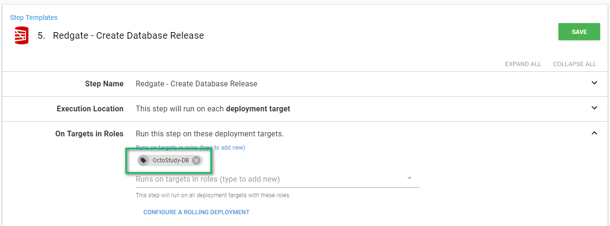
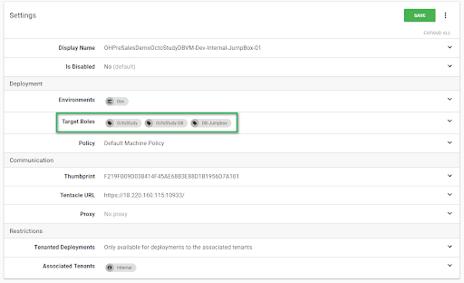
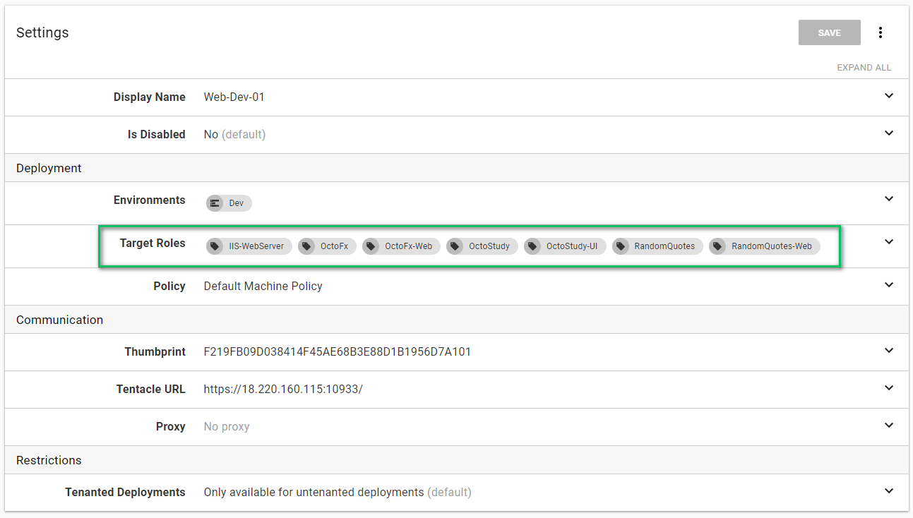

# Chapter 1: Roles, Deployment Targets, and Environments Oh My

Let's start with the very, very basics, modeling your infrastructure and environments.  We wanted to start here first because how you configure your environments, machines and roles sets the tone for everything else.  We feel it is so important to get this right that we wanted to do this first and get it out of the way.

## Deployment Targets  

This is where you are deploying your code.  This could be a Windows machine, a Linux machine, an Azure web application, an offline drop or a namespace in a Kubernetes cluster.  The list of deployment targets is always growing, as soon as we list them out that list will be out of date!  This is where you install the tentacle to handle the deployments.  

## Environments

Environments are a group of deployment targets.  Some common environment names people tend to use are Dev, Test, Staging and Production.  Machines in the Dev environment are used by developers to test their code.  The expected uptime for these machines is rather low due to testing and deployments.  Whereas machines in the production environment are used by customers and are expected to be up 99.999999999999% (or some unrealistic number) of the time.  In our previous jobs we could always tell when a production machine went down because it felt like every alert went off all at once.  

We recommend configuring your environments to match your company’s terminology.  But keep it general.  Think how you want to phrase it during a conversation with a non-technical person.   "I’m pushing some code up to dev" or "I’m deploying my app to production" makes a lot more sense than "I’m pushing to Dev Omaha 45."  What does Omaha mean?  The data center?  Where did 45 come from?  A good indication your environments are modelled correctly is you can explain it in a few quick sentences.  If it takes you longer than a few seconds to explain your environments then that is an indication you need to make some changes.

We recommend keeping the list of environments under a dozen.  For our personal Octopus instances our environments are Dev, Test, Pre-Prod, Production, SpinUp and SpinDown.  That seems to cover 99% of our possible scenarios.

Keeping the number of environments low helps with configuring life cycles, channels, security, and so on.  They also keep your dashboard easy to follow.  When we encounter customers with hundreds of environments the number one complaint we hear is "this isn't scaling all that well" or "our dashboard seems to scroll horizontally forever."

**Octo Horror**: A lot of the customers we work with have machines in multiple data centers.  The temptation is to name your environment "Production [Data Center]," or "Production Omaha." This is done because these particular customers do not want to deploy to all data centers at the same time.  Or they want to know what version of code is in each data center.  This does not scale very well.  Every time you add a new data center you will need to adjust a number of different things, such as your life cycles, retention policies, channels, and so on.  A much better solution to this is using our Multi-Tenancy while still keeping your environment numbers low.  We will be covering some basic multi-tenancy scenarios in later chapters of this book.  

**Octo Horror**: A number of our customers provide SaaS solutions to their customers.  Each customer gets their own set of machines and other resources.  Again the temptation is there to configure a unique set of environments for each customer "Dev [Customer Name]," "Staging [Customer Name]," and "Production [Customer Name]."  This will work for the first dozen or so customers but again it doesn't scale very well.  The multi-tenancy feature in Octopus will address this and a whole host of other scenarios.

Finally, it is important to note, a single deployment target can be tied to more than one environment.  Most of our customers don’t do this, but the functionality is there.  This is useful when you need to share a machine between dev and test or staging and production.    

## Roles

Roles are tags assigned to a deployment target.  A deployment target can have 1 to N number of roles.  Because they are tags, you can get as generic or as specific as you want with the role.  The role assigned to the machine is how Octopus Deploy knows to deploy to it.

For example, a machine has the role of "OctoStudy-DB."  This indicates that this machine is used to deploy database changes for the application "OctoStudy."

In the OctoStudy project, when I want to deploy database changes I assign those steps to the role "OctoStudy-DB."

**Octo Horror**: We have seen instances where customers will assign very generic roles such as "IIS-Server" or "DB-Server."  They then set their project steps to deploy to "IIS-Server" because all of the web applications are hosted on a single IIS Server.  Just like having an environment per data center, this does not scale well.  If one of the applications needs to be moved to another server then a lot of steps in the project need to change.  

Our recommendation for roles is to create both generic roles and specific roles.  Going back to the previous deployment machine for OctoStudy.  A good set of roles for that machine would be "DB-Jumpbox", "OctoStudy-DB" and "OctoStudy."  

"OctoStudy-DB" is used in the project process.

While the other two roles are used for grouping and organization.  When set, you can now see all the machines used for "OctoStudy" or for "DB-JumpBox" by using the advanced filters.

Having a single machine be used for multiple applications is more than fine.  Just please be sure to include all the necessary roles so you are prepared in the future to move machines around.

