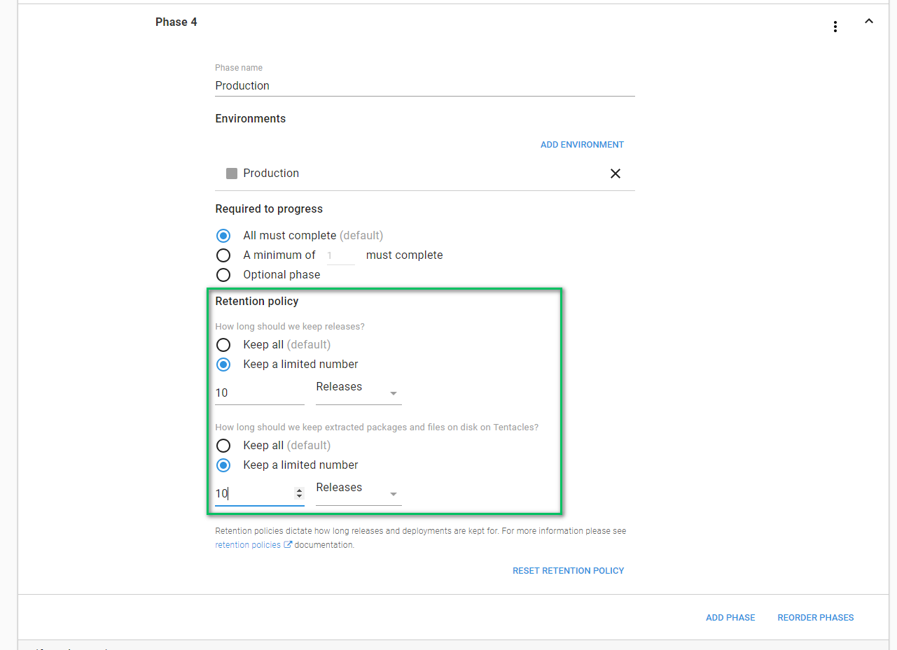

# Chapter 1: Environments, Lifecycles and Retention Policies Oh My!

An interesting fact about artists is they will create what is known as a "study."  This is a sample work to try out new techniques or colors.  The size of the work is much smaller, perhaps 8"x10" compared to the final piece which could be 8'x10'.  They have no intention of selling them (though some of them do if the piece is successful enough).  The reason we bring this is up is because that is how we view a proof of concept with Octopus Deploy.  Great to learn how Octopus Deploy works and get a deployment working, but a new fresh install should be done to ensure from the beginning you have configured everything properly.

If you have an existing instance of Octopus Deploy being used to deploy to production you have a few options.  You can create a new space, which creates essentially a fresh instance of Octopus Deploy, you can stand up a new instance, or you could create new environments and lifecycles and move existing projects over to the new workflow.  It really depends on your requirements.  

## Environments

Environments are the backbone of your deployment pipeline.  It is what you move your code through.  Before you configure your machines or your projects or your lifecycles you need to configure your environments first.  

It seems every place we have worked, and the vast majority of the companies we talk to, have the same four environments, Dev, Test (or QA), Staging (or Pre-Production), and Production.  Which makes sense.  Dev is for developers to experiment on, it is very much in flux, and it is expected to go up and down quite often.  Test is used by quality assurance to write their tests against or manually test.  Staging is used as a final "sanity check" prior to production.  Production...is well production, it is what users connect to.  

When designing Octopus Deploy we didn't want to force people to use pre-defined environments.  Some companies only have three environments, while others have much more.  Not everyone uses the same naming for their environments.  One person's test is another person's QA.  It is important to us to let our customers define their environments using their own naming conventions.  

That flexibility ends up being a double edged sword.  A lot of the customers we work with have machines in multiple data centers.  The temptation is to name your environment "Production [Data Center]," or "Production Omaha." This is done because these particular customers do not want to deploy to all data centers at the same time.  Or they want to know what version of code is in each data center.  This does not scale very well.  Every time you add a new data center you will need to adjust a number of different things, such as your life cycles, retention policies, channels, and so on.  

On top of that, a number of our customers provide SaaS solutions to their customers.  Each customer gets their own set of machines and other resources.  Again the temptation is there to configure a unique set of environments for each customer "Dev [Customer Name]," "Staging [Customer Name]," and "Production [Customer Name]."  This will work for the first dozen or so customers but again it doesn't scale very well. 

In this section we will walk through our recommendations for configuring your environments to better prepare you to scale up and out your Octopus Deploy instance as you add more projects.  We will also walk through a couple of common scenarios we have seen and how to work through them.

### Environments Configuration

We recommend configuring your environments to match your company’s terminology.  But keep it general.  Think how you want to phrase it during a conversation with a non-technical person.   "I’m pushing some code up to dev" or "I’m deploying my app to production" makes a lot more sense than "I’m pushing to Dev Omaha 45."  What does Omaha mean?  The data center?  Where did 45 come from?  

>  A good indication your environments are modelled correctly is you can explain it in a few quick sentences.  If it takes you longer than a few seconds to explain your environments then that is an indication you need to make some changes.  

Keep the list of environments under a dozen or so.  Have the standard four or five environments, such as Dev, Test, Staging and Production.  Also add in SpinUp, TearDown and Maintenance.  Those additional environments will help cover you when it is time to build up servers, tear down applications or if you want to use Octopus to perform some scheduled maintenance tasks like taking a backup of logs in production.  Keeping the number of environments low helps with configuring life cycles, channels, security, and so on.  They also keep your dashboard easy to follow.  When we encounter customers with hundreds of environments the number one complaint we hear is "this isn't scaling all that well" or "our dashboard seems to scroll horizontally forever."

Don't worry about the order of the environments or adding in machines just yet.  That will come a bit later.  For now we just want to get our environments created.  

### Multiple Data Center

In the world of the Azure, AWS, Google Cloud and others to want to be able to deploy to multiple data centers.  In some scenarios the software needs to be deployed in specific intervals, first to a data center in Illinois and then to one in Texas.  The temptation is there to just create more environments called "Environment - [Data Center]."  But that leads to a few issues in scalability as well as maintainability.  

A common scenario we have seen is customers deploy to an on-premise data center for dev, test and staging, but the code is hosted in data centers in Illinois and Texas.  Before pushing to production, they like to run some sanity checks in a staging environment in Illinois and Texas.  If you did environment per data center that would end up being seven environments.  When in reality you only want four.  

Because we don't have any targets or projects setup at this particular point in time, this is rather easy to accomplish.  For now, we will just add two new tenants to Octopus Deploy.  This is accomplished by clicking on the tenant link at the top of the screen and then clicking add tenant in the top right corner.

Don't worry, we will be coming back to them in a later chapter when we start setting up our first multiple data centers project.  Just know that they are there when you need them.

>  Adding images to your tenants makes them easier to find on the tenant screen.  You can accomplish this by clicking on the tenant and selecting settings link on the left.  On that screen you can upload an image for a tenant.

### Multiple Customers

In the same vein of deploying the same project to multiple data centers, a lot of our customers want to deploy the same project to multiple clients.  In a SaaS world we have seen this accomplished one of two ways, make the code responsible for handling the multi-tenancy.  A user logs and the code determines which settings (connection string, name, etc) to load.  For that scenario, the multi-tenancy feature in Octopus Deploy is not needed.

The other way we've seen multi-tenancy accomplished is by giving each client their own set of resources, such as websites, or web applications and a database.  In a lot of cases, the client might need a way to test, so they would need their own testing or staging set of resources as well.  Again the temptation is there to configure a unique set of environments for each customer "Dev [Customer Name]," "Staging [Customer Name]," and "Production [Customer Name]."  This will work for the first dozen or so customers but again it doesn't scale very well.

Imagine if we had five clients, an internal testing customer, Coca-Cola, Ford, Nike and Starbucks.  The internal customer deploys to all the environments, dev, test, staging and prod.  Coca-Cola and Nike have resources in test, staging and production while Ford and Starbucks only have resources in staging and production.  If we did an environment per tenant we would end up with 14 environments.  And that is just for five customers!

This is where the multi-tenancy feature really shines for our customers.  It allows them to keep the number of environments low while at the same time have the ability to create a unique workflow per client.

Fow now we are just going to create those five customers we talked about in this example, Internal, Coca-Cola, Ford, Nike and Starbucks.

## Lifecycles

Now that we have our environments set up (along with our tenants) it is time to define some lifecycles.  A lifecycle is how your code works its way through the variou environments.  It is what tells Octopus Deploy to first deploy to dev, then to test, then to staging, then to production.  

In the previous section we defined seven environments, Development, Testing, Staging, Production, SpinUp, TearDown and Maintenance.  

For 90% of the applications we plan on deploying with Octopus Deploy, we only need Development, Testing, Staging and Production.  We need to adjust the default lifecycle to support that.  This is accomplished by going to library -> lifecycles, selecting the default lifecycle and adding in those four phases.

 

### Default Lifecycle Retention Policy

By default, Octopus Deploy will keep every release and every deployment until the end of time.  We do not want to delete anything without you knowing about it and you manually changing the setting.

In reality...it doesn't make sense to keep every release and every deployment until the end of time.  In six months time do you really want to go back to that previous code?  Is it still useful?  Keeping all those releases is not good for performance either.  Octopus has to hold onto everything for that release, logs, packages, artifacts, snapshot of the process, everything.  That takes up space in your database and on your hard drives.

That is where retention policies are used.  They dictate how long a release is kept on both the server and the tentacle.  Our recommendation is to set the default retention policy to keep five releases by default.

You can override that retention policy for a specific environment.  Which is why for production we recommend increasing that limit to 10.  If you deploy once a week, this will keep 10 weeks worth of production deployments.  Which should cover you for quite a while.

>  If this is your first time applying retention policies then start with a large number (say 600) and work down to your desired number.  Periodically Octopus will automatically apply retention policies.  This task blocks other deployments.  Starting with a large retention policy and going small will allow you to slowly remove releases without blocking deployments.

### Emergency Bug Fix Lifecycle

Emergencies happen.  A critical bug is found in production which must be fixed right away.  In times like that having to deploy to a Development and Testing environment and then Staging and finally Production could slow a lot of things down.  You need to follow your deployment process in times like these.  Trying to circumvent them and do something manually could end up biting you later down the line.  

For this we recommend creating a emergency bug fix lifecycle.  This lifecycle will only have two phases, staging and production.  The retention policies will be the same, 5 for staging and 10 for production.  What this will do is allow you to configure your project to handle an emergency deployment.  You still need a place to test your changes, which is why staging was chosen.  

### Maintenance and other Lifecycles

You will notice that we haven't included the other three environments we created, SpinUp, TearDown and Maintenance.  There should be custom lifecycles for those environments.  For retention policies, limit them to 2 releases for all environments.

>  The infrastructure as code lifecycle is useful for automating the adding of VMs and other infrastructure.  It has a way of throwing random errors, so the SpinUp phase is set as optional.  This will allow you to tear everything down when that occurs and start again.    

## Conclusion

In this chapter we walked through of how to set up the backbone of Octopus Deploy, the environments and lifecycles.  In addition we walked through how to configure retention policies to help keep your Octopus Deploy instance lean and mean.  In the next chapter we will walk through adding our first set of deployment targets for a single project.