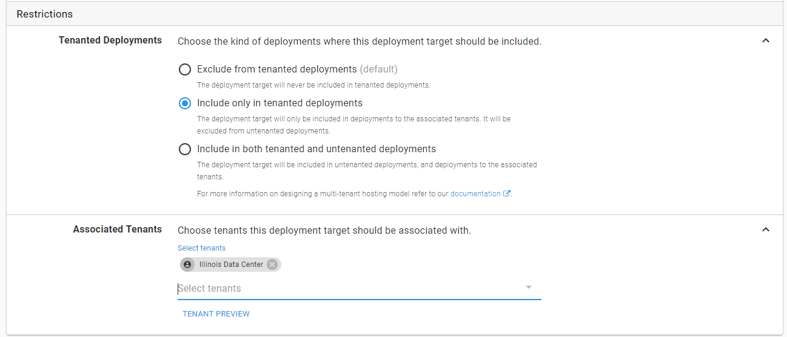

# Everything you wanted to know about deployment targets, roles and machine policies (but were afraid to ask)

We have the environments and project processes.  Now we need to configure a couple of deployment targets.  Deployment targets are what you will deploy the code to.  A deployment target is typically a Windows VM running a small windows service known as a tentacle.  The Octopus Deploy server connects to that tentacle and instructs it to do work.  But a deployment target is not just a tentacle.  As time has gone on we have added more and more deployment targets types.  Now there are Windows Targets, SSH Connections (for Linux machines), Azure Targets, Kubernetes Clusters, Offline Drops and Cloud Regions.  That list keeps growing and growing.  We are willing to bet that by the time you read this book that list will have changed.

When you were setting up a proof of concept or a pilot project chances are you didn't much thought to the add target form.  We know we didn't.  We just wanted to add a machine into Octopus so we could start defining our deployment process and getting some code pushed out.  When registering a deployment target there is the standard "what environment should this target be placed in" option, but you are also given a few other options, such as roles, machine policies, and tenants that tend to create some confusion and the opportunity for some misconfigurations.  

## Naming

Naming.  Easy to learn.  Hard to master.  A good machine name will describe the machine and its purpose in a succinct manner.  You might have your own internal naming conventions for machines, and that is great, use that if possible.  The problem a lot of people will run into is when they are naming PaaS targets such as Kubernetes, Azure Web Apps and Service Fabric clusters.

If each application gets its own set of resources or its own machine, a good naming guideline to follow is [EnvironmentPrefix]-[AppName]-[Component]-[Number].  Or [EnvironmentPrefix]-[AppName][Component][Number].  For example, the machine hosting the OctoFX Website in Dev would be named `d-octofx-web-01`.

If you have multiple applications sharing the same resources then having a succint name describing the type of apps it hosts is key.  For internal websites on test a good name would be `t-internal-web-01`.

## Roles

Roles are a little trickier and tend to trip up a lot of people.  If you remember when we created the deployment process we had to pick a role for the step to run on.  How it works with Octopus Deploy is it will grab all the machines for that role and run the script on that machine.

All too often we run across scenarios where a customer has created a role called `IIS-Server` because they only had one or two servers hosting all their web applications.  This worked fine until they decided to move a small subset of applications to a new server.  They tried using the same role, `IIS-Server` but when they went to deploy they had all the projects being deployed to both the new and the old servers.  

The problem is the role `IIS-Server` is too generic.  Some of the customers we have talked to think that a machine can only have a single role.  But in reality, roles are nothing more than tags.  You can have 1 to N number of roles assigned to a specific target.  Because of that, we recommend using specific roles.  

For the machine deploying to OctoFX-Web we recommend the roles `OctoFX` and `OctoFX-Web`.  

For the database the roles would be `OctoFX` and `OctoFX-DB`.  

The reason we recommend including the role `OctoFX` is for organization and searching.  Tou can then use the filtering functionality on the deployment target page to find all the machines being used for OctoFX deployments.  

The roles `OctoFX-Web` and `OctoFX-DB` are what is being used in the deployment process.

If you wanted to keep track of all the IIS Servers in your infrastructure then by all means add the role `IIS-Server`.  Just don't have any steps specifically target that role.

In the event you have several applications being hosted on the same target then you can add a role for each application.

It does feel a bit tedious to constantly be adding roles to an existing target, but it makes changes in your infrastructure much easier to change.  If new servers are created to move a subset of applications over all you need to do is remove those roles from the old machine and add them to the new machine.  You don't have to adjust your deployment process or create a new release.  In fact, once the roles are added you can re-run the deployment for the environment and the new machines will get the latest and greatest code (in later chapters we will discuss triggers on how to automate this).    

>  Adding dozens upon dozens of application roles to a single target might be an indication that server is trying to host too much.  If you have the resources consider splitting up the server.  

## Tenants

The last piece of the add deployment target form is the tenants section.  This will allow you to specify if the target should be used for tenant deployments.  If the deployment target is going to be used for a specific tenant then it would make sense to adjust the name [EnvironmentPrefix]-[TenantName]-[AppName]-[Component]-[Number].  So `d-ford-octofx-web-01` if we wanted the machine to deploy the OctoFX website for Ford to Dev.

It is possible for a deployment target to be used for both non-tenant deployments as well tenant deployments.  This typically done for virtual machines which host lots of applications and tenants.  This is not something we would recommend in production, but it is possible.  It would make more sense in the lower environments when the resources tend to be more limited.

In the scenario where you are using tenants to deploy to multiple data centers this is where you would specify the data center this deployment target is for.  

## Machine Policies

One screen and concept we have danced around for the past several chapters is machine policies.  You probably noticed it on the left hand menu and didn't think much of it.

Periodically the Octopus Deploy server needs to make sure that it can still connect to all the deployment targets doing what is known as a health check. It does this as a sanity check and also to make sure the server has crashed or is about to run out of space.  By default health checks are performed every hour.  And by default all machines are added into the default machine policy.  And finally by default if Octopus is unable to connect to the machine it will throw an error and fail the health check.  In some cases this is desired and in other cases this is not desired.  All this is controlled via the machine policy.  

Having all the deployment targets on the same machine policy is not a big deal when you only have a couple of dozen of machines.  The health checks are quick.  It really starts to cause problems when you have thousands of machines.  A health check could take hours to complete.  It can only connect to 10 machines at a time to perform the health check, it can take a while to finish up.  

You also might have a group of machines which are flaky and tend to go up and down.  Perhaps they are test instances or they are hosted on a client's site and your connection is spotty.  You anticipate them to fail once in a while.  You shouldn't change your default machine policy to account for one or two spotty machines.  If the other machines go down you want to know about it.

## Leveraging Infrastructure as Code