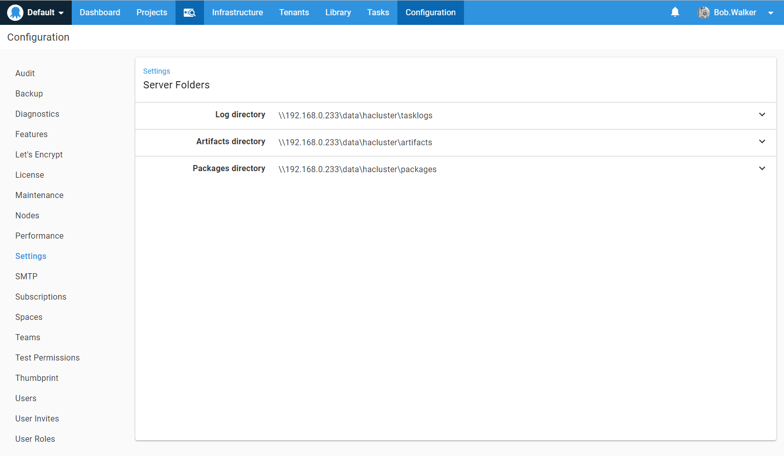
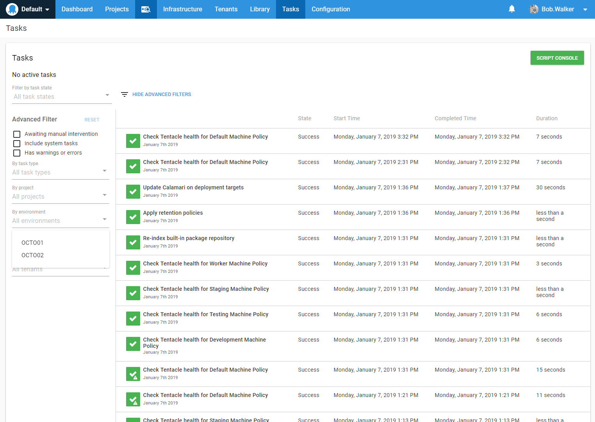

# What Is Data Center and Why Would I Need It?

Everything we presented so far in this book can be done using the Standard Edition of Octopus Deploy. The standard license of Octopus Deploy provides quite a bit of functionality.  You get unlimited users, projects, and workers.  You get up to three unique instances of Octopus Deploy.  You get 3 spaces per instance.  There is a lot there.  So... what exactly does Data Center provide?

## Driving Force Behind Data Center

Octopus Deploy was originally designed to run on a single server.  Our customers would scale up the resources dedicated to that server as they scaled up the number of projects, deployment targets, and users.  But eventually, they reached a breaking point where it was impossible to scale up any further.  There are only so many network connections and concurrent processes a computer can run.  

Additionally, our customers had unwittingly created a massive single point of failure in their CD pipelines.  If their server were to ever go down, for whatever reason (the most common cause was Windows patches), that would bring all deployments to a grinding halt.  When this only affected a team of 10-15 people it was an annoyance.  When it affected an entire development shop of 100s of people this became a major problem.  

Finally, a lot of our customers started treating their Octopus Servers like pets rather than chattel. The default configuration of Octopus Deploy didn't help much.  All folders are stored on the C:\ drive, and if that server were to ever crash a lot of data would be lost.  And if the master key was ever lost then getting it back up and running could take quite a while.

## Data Center Overview

The standard edition of Octopus Deploy allowed you to have three (3) unique instances running.  We determine uniqueness based on the database it is pointing to.  With standard edition, you can only connect each instance of Octopus server to a single database.  Octopus Deploy Data Center allows you to connect several instances to the same database.  The limit of three instances is gone which allows you to create clusters of Octopus Deploy servers.  The only kicker is the total number of targets, across all clusters the total number of targets must be below your license count.  If you have a 1000 Machine Data Center license you can have 10 clusters with 100 targets each.  Or, 1 cluster with 1000 targets.

All the servers in the cluster use the same master key.  They both point to the same database.  All the task logs, artifacts, and packages must be on a file share which both servers can access.  Typically the file share is on a NAS or on a DFS share.  

The Octopus Servers use the database to coordinate tasks.  Each server has its own task cap.  

When a task is added into the queue to be processed one of the servers will pick it up.  A task could be anything, a deployment, a health check, retention policy check, etc.  When looking at the task log you can filter by node to see which one is doing the work.

There are still some behind the scenes things only one server can do, such as processing subscriptions or scheduled tasks.  This is why you see the label `Leader` and another label `Follower`.  An Octopus Deploy server cluster can only have one leader, but it can have many followers.  If the leader is offline for an extended period of time, then one of the followers will become the leader.

## Data Center Benefits

Data Center solves a number of the aforementioned issues.  To begin with, you can have a cluster of multiple servers.  This allows you to scale out the Octopus Deploy server horizontally as well as vertically.  This reduces the IOPS required when using a single server to deploy to thousands of machines.

The Octopus Deploy UI is stateless.  This means you can put a load balancer in front of the Octopus Deploy cluster.  Which brings us to the next point.  You no longer have a single point of failure.  If a restart occurs on one of the nodes, the other servers keeps on humming along and handles the deployments.  The UI also continues to function as well (assuming it is behind a load balancer).

Because the important file directories are in a shared location, this makes it easier to spin up new Octopus Deploy servers.  When it comes time to upgrade the version of Windows, you can simply stand up a new Windows server and install Octopus Deploy on it.  You only have to point some configuration entries at the new shared file location and database.

Finally, the Data Center license is the top tier license.  Of the functionality Octopus Deploy provides, it has the highest limits possible.  Standard Edition can have 3 spaces while Data Center gets unlimited spaces.  Standard edition gets 3 unique instances while Data Center gets unlimited instances.  Standard edition only gets 1 node per database while Data Center gets unlimited nodes per database.  

## Conclusion

Octopus Standard Edition is great when you are getting started with Octopus Deploy.  We've found that once customers hit 300 machines or so they move from beginners to advanced users.  They also start running into the initial limits, such as the 5 concurrent task cap.  Because they don't have the ability to scale horizontally they start to scale vertically.  This allow you to configure Octopus Deploy to scale much earlier than before.  

Some good indicators you need Data Center are that you have more than 100 machines, you need to have more than 5 concurrent tasks running, you are doing hundreds of deployments a day, or you worry about the single point of failure in the CD pipeline.
