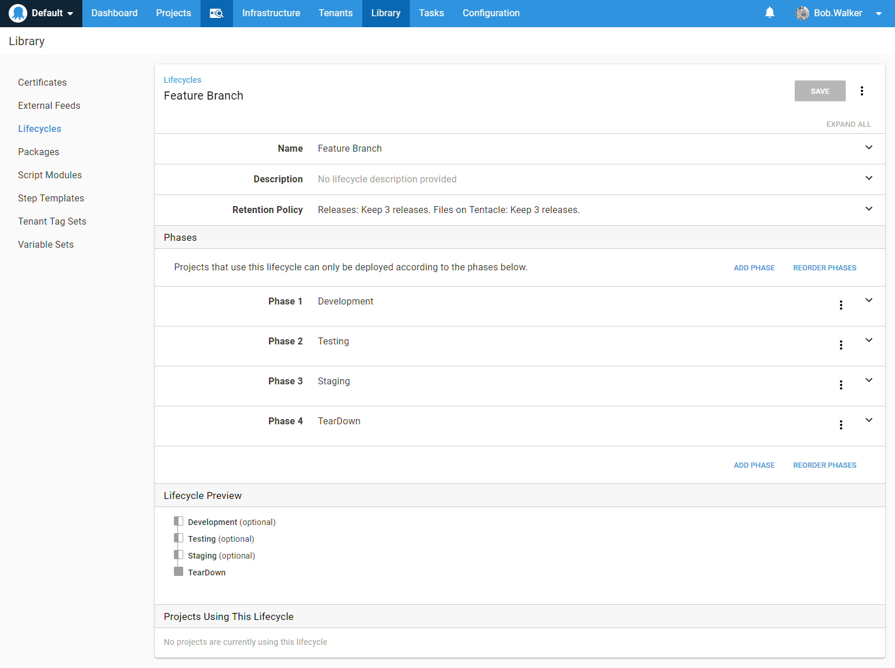

# Feature Branch Deployments

One of the great things about GIT is how easy it is to create a branch.  And having the ability to branch easily is great.  It allows for experimentation.  A developer can try out an idea in a branch and if it doesn't work they can delete the branch.  No fuss.  No muss.  Or they can start work on a new feature in a feature branch and when the feature is complete everything is merged in to the main branch.  

There eventually comes a time where developers need to get feedback.  They want to check-in the code and deploy it so someone else can take a look at it.  Often times the code is in an incomplete state.  It shouldn't be merged into master or development.  That could have some serious consequences.  Incomplete code could get pushed out to test or heaven forbid, production, before it is ready.  QA doesn't want to test imcomplete code.  

A common technique is to hide the change behind a feature flag.  But that doesn't scale all that well.  Depending on the change, there could be a lot of if/then statements for the change.  And eventually someone has to go in and clean up that feature flag.  Which causes more work.

In a perfect world, that feature branch would get its own set of resources.  In our example application, OctoFX, this means a website and a database.  Those resources would be automatically created when the user pushes the feature branch up to the server.  

If you recall in our projects chapter we said a core rule when configuring your projects is `Projects should be responsible for setting up what it needs to run.`  This means creating a website and database.  And if you followed along when we configured our projects for OctoFX you know both the database and the web server project were configured with that in mind.  The database project will create the database if it does not exist.  The WebUI project will create the website if it doesn't exist.  All of that is covered.  

We just need to make a few other tweaks to Octopus Deploy to help support this scenario.

## Lifecycles

The first question you need to answer is, what environments will the feature branch be deployed to?  With our four environments on our instance, Dev, Testing, Staging and Production, we would say Dev, Testing, and Staging.  We included staging because we often see staging is a mirror of production.  Meaning the outside world has access to it.  Maybe it is used for UAT for business owners, or as a place to get feedback from external customers.  If that is the case, you should be able to deploy to that environment with your feature branch.  There might be a case where you want to get feedback from external customers before merging the feature into the master branch.

The resources being created for the feature branch, the database and the website, have a finite lifespan.  We will need to destroy them once the feature branch has been merged into master.  As a result of that, we should include a "TearDown" environment in our lifecycle.

Finally, we don't know how far we are going to push this feature branch.  We might only push it to dev to get some quick feedback.  Or we might push it all the way to staging.  As such, each phase in the lifecycle, Dev, Testing, and Staging should be optional.  

We will create a new lifecycle to support this.  

