# Feature Branch Deployments

One of the great things about GIT is how easy it is to create a branch.  That ability has several benefits.  Namely, it allows for experimentation.  A developer can try out an idea in a branch and if it doesn't work they can delete the branch.  No fuss.  No muss.  Or they can start work on a new feature in a feature branch.  Once the feature is complete everything is merged into the main branch.  

Eventually developers will need to get feedback on the feature branch.  They want to check-in the code and deploy it so someone else can take a look at it.  Often times the code is in an incomplete state.  It shouldn't be merged into master or development.  That could have some serious consequences.  Incomplete code could get pushed out to test or heaven forbid, production before it is ready.  QA doesn't want to test incomplete code.  

A common technique is to hide the change behind a feature flag.  But that doesn't scale all that well.  Depending on the change, there could be a lot of if/then statements for the change.  Someone has to go in and clean up that feature flag.  Which causes more work.

In a perfect world, that feature branch would get its own set of resources.  In our example application, OctoFX, this means a website and a database.  Those resources would be automatically created when the user pushes the feature branch up to the server.  

If you recall in our projects chapter we said a core rule when configuring your projects is `Projects should be responsible for setting up what it needs to run`.  This means creating a website and database.  In that chapter we created the database and web project with that rule in mind.  The database project will create the database if it does not exist.  The WebUI project will create a website if it doesn't exist.  Resource creation is covered.  

We need to make a few other tweaks to Octopus Deploy to help support this scenario.

## Lifecycle

First, we need to determine which environments we are going to be deploying to.  In this book, we have been using four environments, Development, Testing, Staging, and Production.  Our recommendation is to to be able to deploy to an environment where users can test out the changes.  If you are working on a SaaS application, very often staging is a mirror of Production.  The outside world has access to connect to it.  Getting feedback from our external users means deploying all the way to Staging.  No external users?  Deploying to Development and Testing makes more sense.

Another item to consider, the resources being created for the feature branch, the database and the website, have a finite lifespan.  We will need to destroy them once the feature branch has been merged into master.  As a result of that, we should include a "TearDown" environment in our lifecycle.

Each feature branch will be different.  Some will go to development only.  Others will go to Testing.  And others might go all the way to Staging.  We still need to deploy to TearDown to destroy the temporary website and database.  Each phase in the lifecycle, Development, Testing, and Staging should be optional.  

We will create a new lifecycle to support this scenario.  


## Channels and Versioning

Channels allow you to tie more than one lifecycle to a project.  We will need to create a new channel to make use of this new lifecycle.

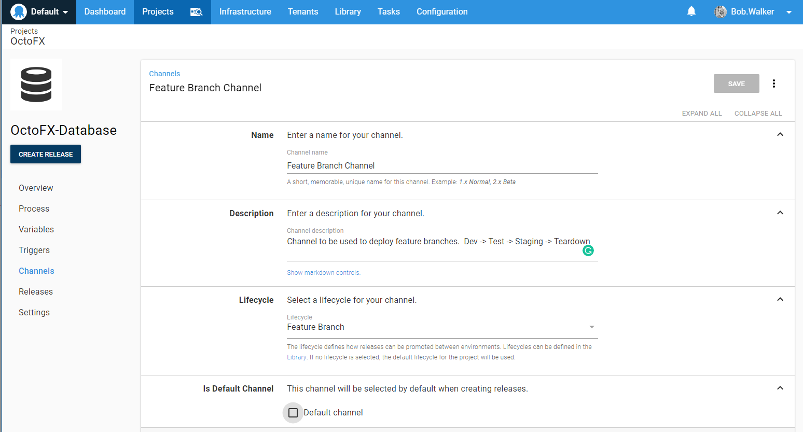

Octopus Deploy adopts a modified version of SemVer.  We are not as strict as SemVer. Octopus Deploy implements a number of its requirements.  This includes support for pre-release text after the version number (IE 2018.1.9-PreRelease or 1.0.0.0-PreRelease).  We will be making use of that pre-release text.  This will be for both the package version as well as the release number.  

We will create a version rule for this channel where it only accepts packages with pre-release text.

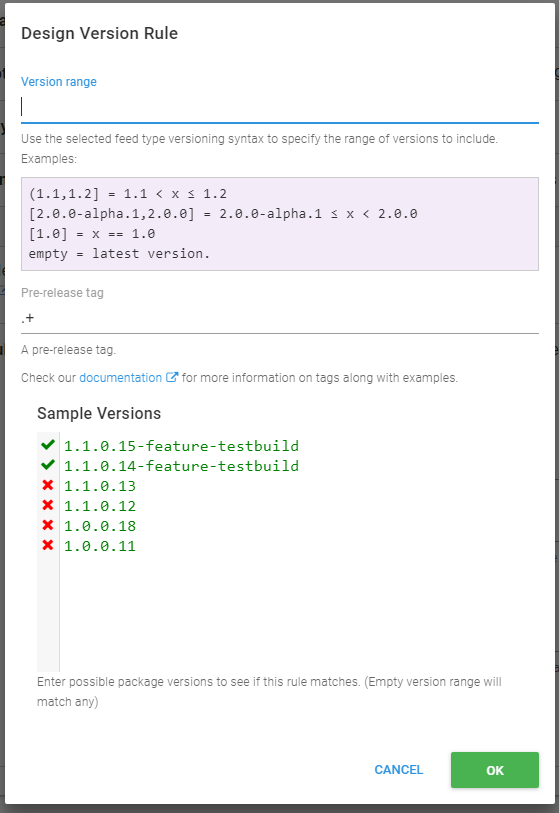

We need to go back to the default channel and tell it to accept any version without pre-release tags.

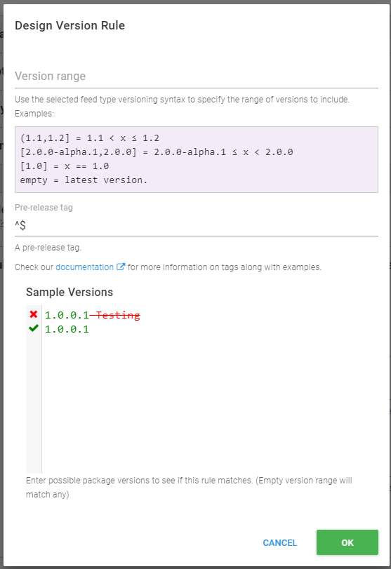

Now we have multiple channels to deploy to.

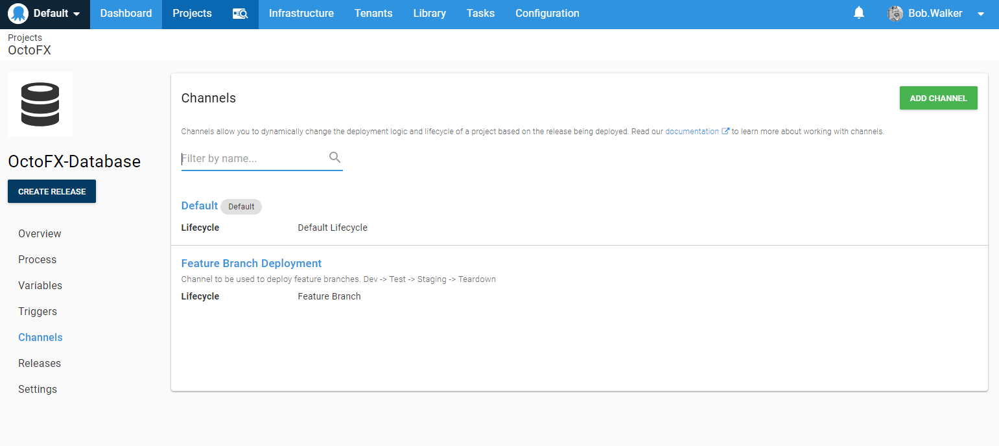

The only downside is you will need to repeat that for each of our projects we want to deploy feature branches.

## Process Changes

If you have been following along so far with the book, you will note everything in the process is driven by variables.  From the database deployments:

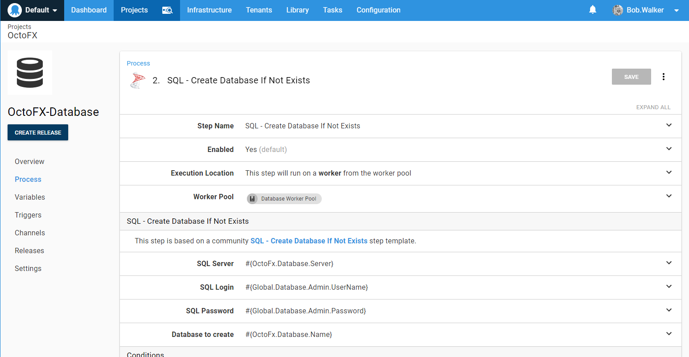

To the WebUI Deployments:

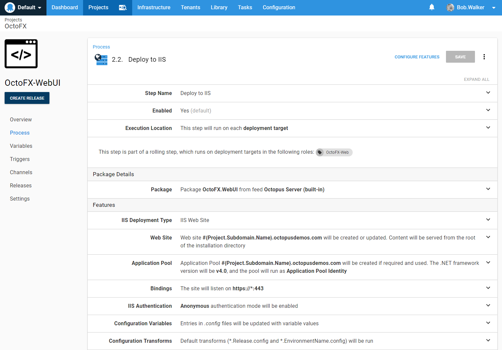

We recommended driving your process using variables for this very reason.  We can change around those variables and not have to worry too much about our process.  That being said, there might be a couple of new variables we will have to use.  

### The Case Against Using Tenants

There are two approaches to deploying feature branches.  The first approach to consider is using tenants.  Each feature branch becomes a tenant.  

At first blush, this makes the most sense.  The problem is, that doesn't scale all that well.  Feature branches have a finite lifespan, a few days or a couple of weeks.  You will be adding/removing tenants quite often.  Yes, it is possible to automate that using the API, but that is brittle.  

You also might have hundreds of projects on your Octopus Deploy server.  You could have hundreds or even thousands of tenants for feature branches.   With that many projects, there is a good chance for feature branch naming collision.  Unless you come up with a naming standard where the feature branch has to include the name of the project.  

In addition, you might already have regular customers as tenants. Feature branches as tenants would add to the list and make it harder to find a customer tenant.  

The last issue is the tenant clean-up.  If you happen to have a tenant name collision, when should the clean-up occur?  How would you schedule something like that?  

### Using Output Variables

Rather than using tenants for feature branches, we will be using the release name to drive this.  At the start of the process, we will have a PowerShell step to set an output variable based on the release name.  The PowerShell script will only run on the channel we created for feature branch deployments.  

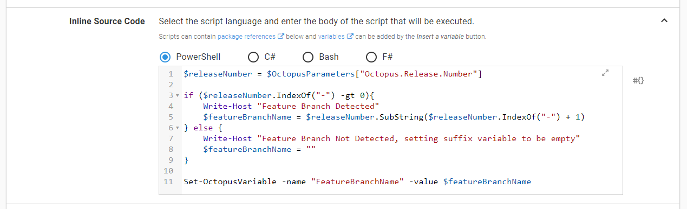

Here is the PowerShell script for you to use on your own server.

```
$releaseNumber = $OctopusParameters["Octopus.Release.Number"]

if ($releaseNumber.IndexOf("-") -gt 0){
    Write-Host "Feature Branch Detected"
    $featureBranchName = $releaseNumber.SubString($releaseNumber.IndexOf("-") + 1)
    $featureBranchName = $featureBranchName.ToLower().Replace(" ", "")     
} else {
    Write-Host "Feature Branch Not Detected, setting suffix variable to be empty"    
    $featureBranchName = ""    
}

Set-OctopusVariable -name "FeatureBranchName" -value $featureBranchName
```

We recommend putting that script into a step template.  This will allow you to share this PowerShell script with other projects.

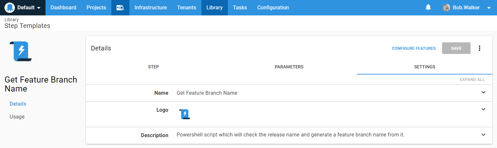

Add that step template to your process and configure it to only run for the feature branch channel.  That step should appear first. It will be setting an output variable every other step will need to use.  Also, notice the manual intervention step is configured to only run for default channels.  This will allow you to deploy the feature branch to staging without having to get approval.  The idea of this is to get to staging to get feedback as fast as possible.  The branch, and by extension the resources on staging, shouldn't live up there very long.  

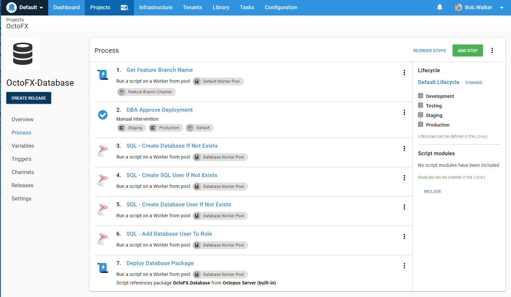

That step will set an output variable, `FeatureBranchName`.  The syntax to get that variable is: `Octopus.Action[Get Feature Branch Name].Output.FeatureBranchName`.  That is a bit much to remember.  And if the step name were to ever change you would have to go back through all the steps and change that name.  

We recommend creating a variable to store that output variable.  Scope that output variable to the feature branch deployment channel.  Scope an empty variable to the default channel.

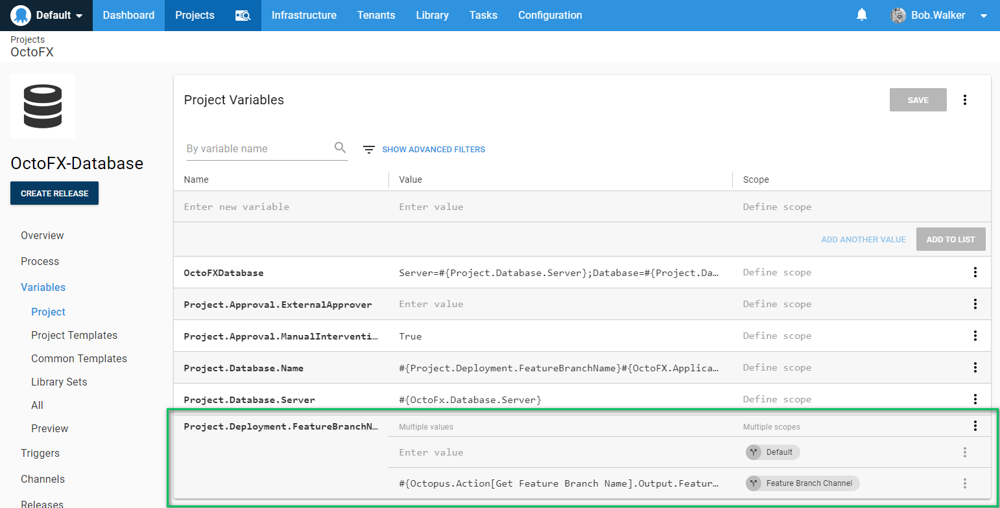

With that variable created we can modify a couple of other variables to make use of that.

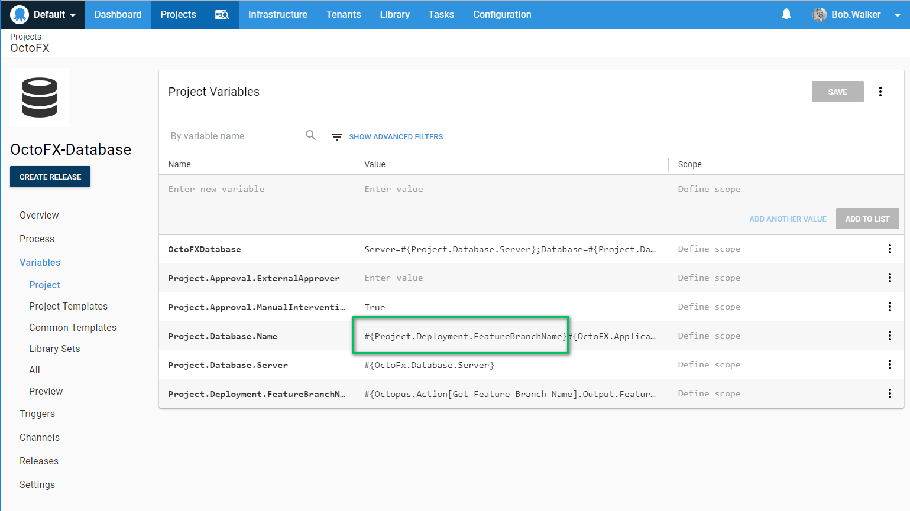

In this particular example, we created a new variable to store the database name.  We just need to adjust any steps which make use of that variable.  

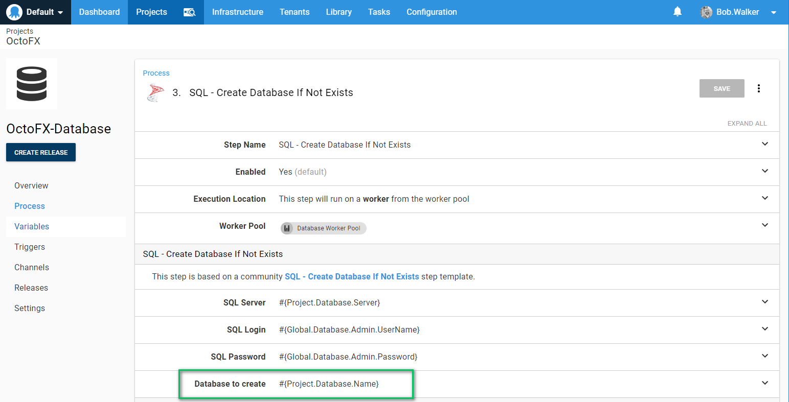

>  A good rule of thumb is to use project variables to reference variable set variables.  This way, if you do need to overwrite the variable at a local level, for whatever reason, you can, and you don't have to go through the exercise of updating all your steps.

For each project, you wish to do this for, you will need to repeat the process of adding the new step and making any variable adjustments.

## Creating Feature Branch Release

When you create a feature branch release you will need to specify the channel.  In the UI this is done by selecting the channel from the drop-down list.

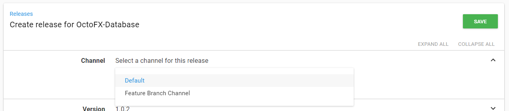

That applies to the Octopus User Interface only.  The goal here is to automate all of this.  A developer checks in their code to a feature branch.  The build server sees the feature branch and creates a release on the separate channel.  

First, the build server needs to be configured to monitor any branch, not just master.  For TeamCity that is a setting in the version control settings for the build.

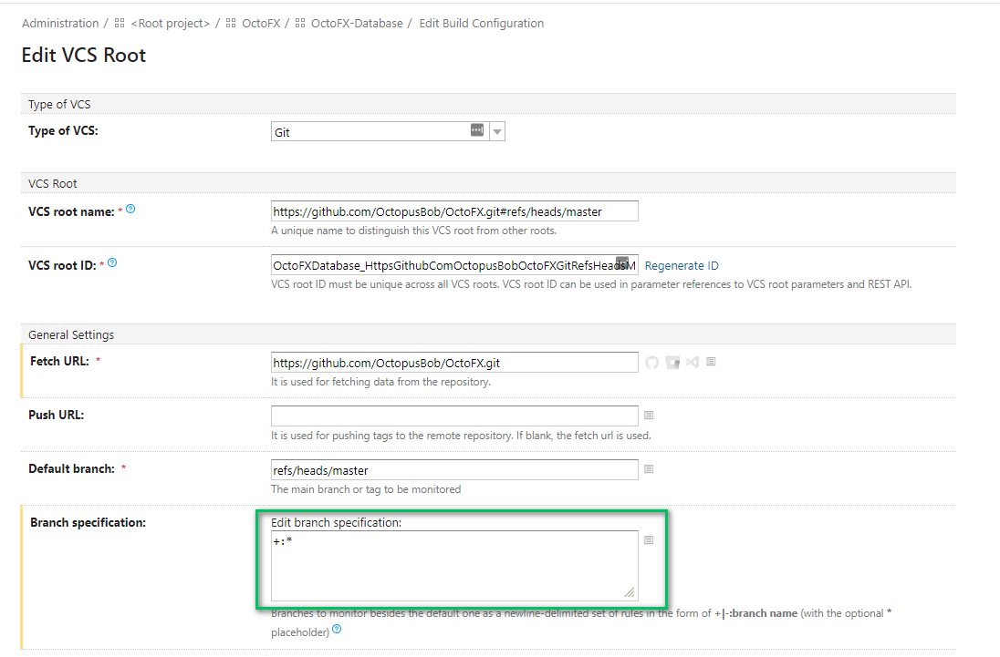

For TFS/VSTS/Azure DevOps the syntax looks like:

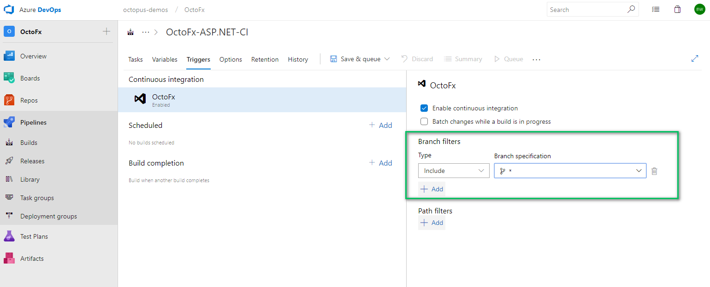

Most, if not all, build servers store the name which triggered the build in a variable.  Using that variable we can determine which channel to deploy to.  Here is a simple script which was written for TeamCity.  At the end of the script, the variables env.octopusChannel and env.octopusVersion are set.  Later steps in the process will use that variable.

```
Param(    
    [string]$currentBranch,
    [string]$buildNumber,
    [string]$defaultMajorVersion,
    [string]$featureBranchVersion
)

Write-Host "BuildNumber: $buildNumber"
Write-Host "DefaultMajorVersion: $defaultMajorVersion"
Write-Host "FeatureBranchVersion: $featureBranchVersion"

$channelName = "Default"
$releaseVersion = "$defaultMajorVersion.$buildNumber"

Write-Host "This is the branch that is building: $currentBranch"

if ($currentBranch -ne "refs/heads/master"){
    Write-Host "Non-master branch detected, using feature branches instead"
    $channelName = "Feature Branch Channel"
    $replacementBranchName = $currentBranch.replace("refs/heads/", "").replace(" ", "")
    $releaseVersion = "$featureBranchVersion.$buildNumber-$replacementBranchName"
}

"##teamcity[setParameter name='env.octopusChannel' value='$channelName']"
"##teamcity[setParameter name='env.octopusVersion' value='$releaseVersion']"
```

The script for TFS/VSTS/Azure DevOps would be:

```
Param(    
    [string]$currentBranch,
    [string]$buildNumber,
    [string]$defaultMajorVersion,
    [string]$featureBranchVersion
)

Write-Host "BuildNumber: $buildNumber"
Write-Host "DefaultMajorVersion: $defaultMajorVersion"
Write-Host "FeatureBranchVersion: $featureBranchVersion"

$channelName = "Default"
$releaseVersion = "$defaultMajorVersion.$buildNumber"

Write-Host "This is the branch that is building: $currentBranch"

if ($currentBranch -ne "refs/heads/master"){
    Write-Host "Non-master branch detected, using feature branches instead"
    $channelName = "Feature Branch Channel"
    $replacementBranchName = $currentBranch.replace("refs/heads/", "").replace(" ", "")
    $releaseVersion = "$featureBranchVersion.$buildNumber-$replacementBranchName"
}

Write-Host "##vso[task.setvariable variable=octopusChannel;issecret=true]$channelName"
Write-Host "##vso[task.setvariable variable=octopusVersion;issecret=true]$releaseVersion"
```

For the steps which package the output into packages and push those packages to Octopus Deploy will use the version variable.

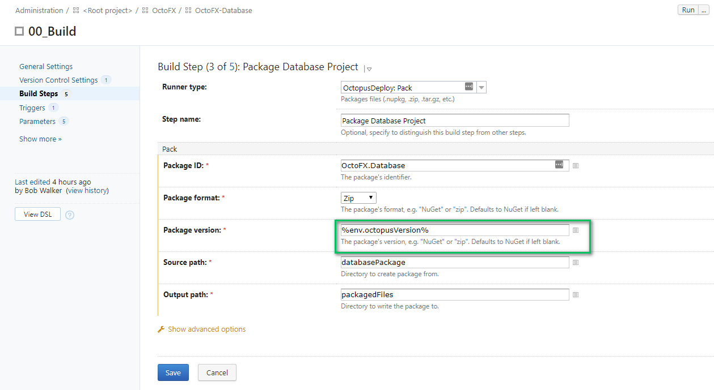

The step which creates the release will use the channel and version variable.

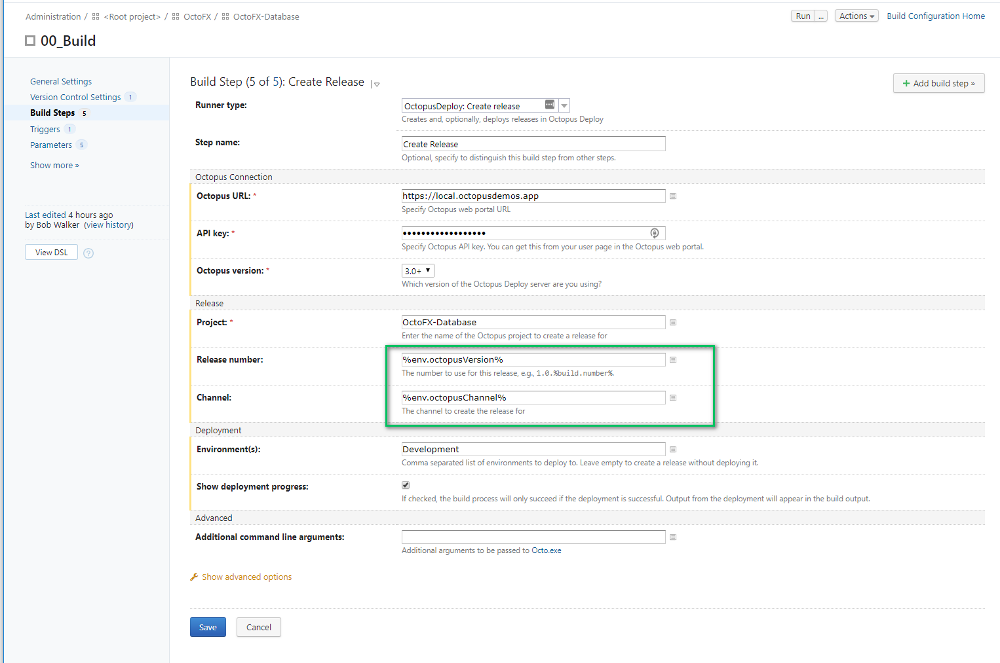

Everything else in the process, the build steps, the testing steps, and so on, remain the same.  

## Deploying Feature Branch Releases

Deploying feature branch releases is just like any other deployment.  Except for this time, it will dynamically change a few values during the deployment to account for the feature branch name.

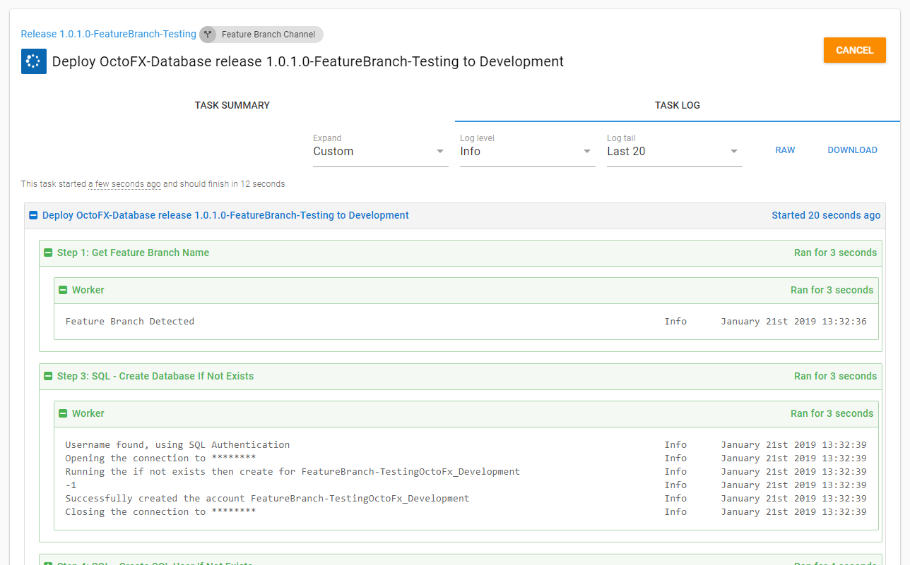

The overview screen will now show the feature branches which have been deployed.


## Teardown Feature Branch

The final step will be to tear down everything which has been built up for the feature branch.  In this example it will delete any database created by the feature branch process.  Note the environment for this step is `TearDown` and it is for the feature branch channel only.  Also, note all the other steps in this process skip the `TearDown` environment.

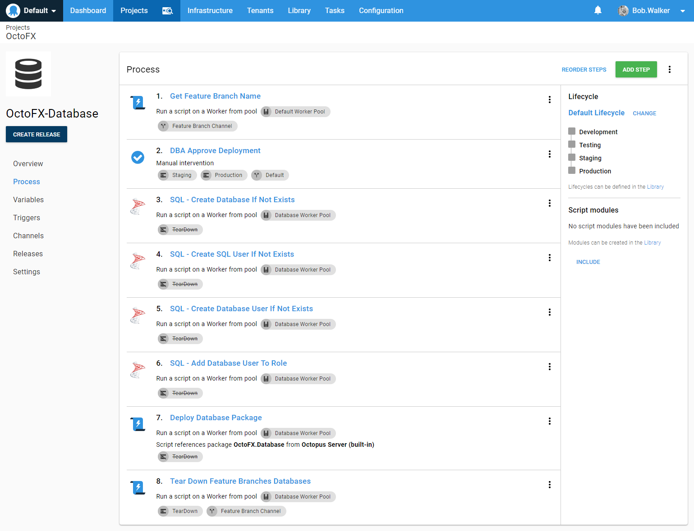

If your build server supports it, kicking off a build or pushing a deployment to teardown when a branch is merged into master or deleted would be a good way to automate the clean-up process.  

## Conclusion

With some minor modifications, it is possible to start deploying feature branches using Octopus Deploy.  This allows you to get feedback quickly from your business owners, QA, or external users without requiring you to merge into master.  With this approach, it will support as many feature branches as you would like and you can tear them as needed.  
