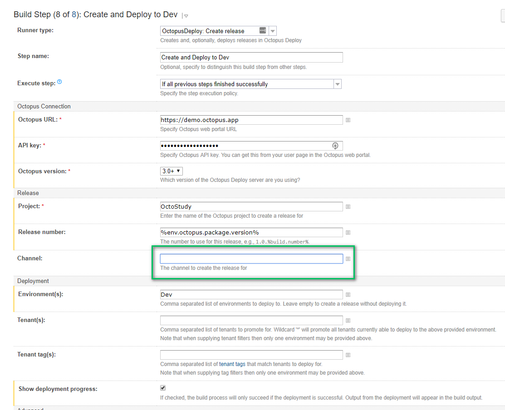
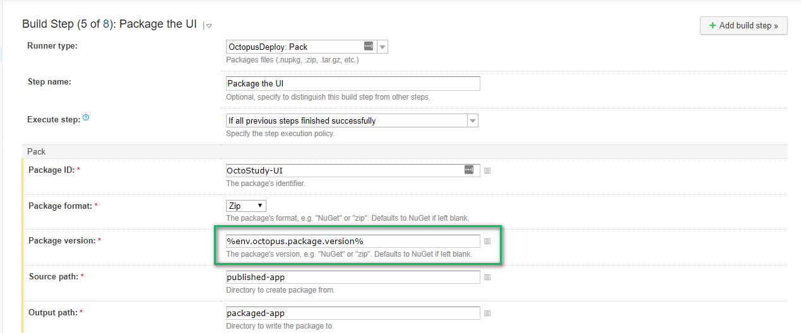

# Feature Branch Deployments

One of the great things about GIT is how easy it is to create a branch.  And having the ability to branch easily is great.  It allows for experimentation.  A developer can try out an idea in a branch and if it doesn't work they can delete the branch.  No fuss.  No muss.  Or they can start work on a new feature in a feature branch and when the feature is complete everything is merged in to the main branch.  

There eventually comes a time where developers need to get feedback.  They want to check-in the code and deploy it so someone else can take a look at it.  Often times the code is in an incomplete state.  It shouldn't be merged into master or development.  That could have some serious consequences.  Incomplete code could get pushed out to test or heaven forbid, production, before it is ready.  QA doesn't want to test imcomplete code.  

A common technique is to hide the change behind a feature flag.  But that doesn't scale all that well.  Depending on the change, there could be a lot of if/then statements for the change.  And eventually someone has to go in and clean up that feature flag.  Which causes more work.

In a perfect world, that feature branch would get its own set of resources.  In our example application, OctoFX, this means a website and a database.  Those resources would be automatically created when the user pushes the feature branch up to the server.  

If you recall in our projects chapter we said a core rule when configuring your projects is `Projects should be responsible for setting up what it needs to run.`  This means creating a website and database.  And if you followed along when we configured our projects for OctoFX you know both the database and the web server project were configured with that in mind.  The database project will create the database if it does not exist.  The WebUI project will create the website if it doesn't exist.  All of that is covered.  

We just need to make a few other tweaks to Octopus Deploy to help support this scenario.

## Lifecycle

The first question you need to answer is, what environments will the feature branch be deployed to?  With our four environments on our instance, Dev, Testing, Staging and Production, we would say Dev, Testing, and Staging.  We included staging because we often see staging is a mirror of production.  Meaning the outside world has access to it.  Maybe it is used for UAT for business owners, or as a place to get feedback from external customers.  If that is the case, you should be able to deploy to that environment with your feature branch.  There might be a case where you want to get feedback from external customers before merging the feature into the master branch.

The resources being created for the feature branch, the database and the website, have a finite lifespan.  We will need to destroy them once the feature branch has been merged into master.  As a result of that, we should include a "TearDown" environment in our lifecycle.

Finally, we don't know how far we are going to push this feature branch.  We might only push it to dev to get some quick feedback.  Or we might push it all the way to staging.  As such, each phase in the lifecycle, Dev, Testing, and Staging should be optional.  

We will create a new lifecycle to support this scenario.  


## Channels

Channels allow you to make use of a lifecycle different than the project's default lifecycle.  We will be need to create a new channel to make use of this new lifecycle.


### Versioning

Octopus Deploy adopts a modified version of SemVer.  We are not as strict as SemVer, but we implement a number of it's requirements.  This includes support for pre-release text after the version number (IE 2018.1.9 or 1.0.0.0).  We will be making use of that pre-release text.  This will be for both the package version as well as the release number.  

We will create a version rule for this channel where it only accepts packages with pre-release text.


We need to go back to the default channel and tell it to only accept non pre-release tags.


Now we have multiple channels to deploy to.


The only downside is you will need to repeat that for each of our projects we want to deploy feature branches to.

## Process Changes

If you have been following along so far with the book, you will note everything in the process is driven by variables.  From the database deployments:


To the WebUI Deployments:


We recommend driving your process using variables for this very reason.  We can change around those variables and not have to worry too much about our process.  That being said, there might be a couple of new variables we will have to use.  

### The case against using tenants

There are two approaches to deploying feature branches.  The first approach to consider is using tenants.  Each feature branch becomes a tenant.  

At first blush, this makes the most sense.  The problem is, that doesn't scale all that well.  Feature branches have a finite lifespan, perhaps a few days or maybe a couple of weeks.  You will be adding/removing tenants quite often.  Yes, it is possible to automate that using the API, but that is fairly brittle.  

You also might have hundreds of projects on your octopus server.  You could have hundreds or even thousands of tenants for feature branches.  If you are working on a SaaS product which is already multi-tenant, that could be very confusing to see so many additional tenants.  With that many projects, there is a good chance for feature branch naming collision.  Unless you come up with a naming standard where the feature branch has to include the name of the project.  

The last issue is tenant clean-up.  If you happen to have a tenant name collision, when should the clean-up occur?  How would you schedule something like that?  

### Using output variables

Rather than using tenants for feature branches, we will be using the release name to drive all of this.  At the start of the process we will have a PowerShell step to set an output variable based on the release name.  The PowerShell script will only run on the channel we created for feature branch deployments.  


Here is the PowerShell script for you to use on your own server.

```
$releaseNumber = $OctopusParameters["Octopus.Release.Number"]

if ($releaseNumber.IndexOf("-") -gt 0){
	Write-Host "Feature Branch Detected"
	$featureBranchName = $releaseNumber.SubString($releaseNumber.IndexOf("-") + 1)
    $featureBranchName = $featureBranchName.ToLower().Replace(" ", "")     
} else {
	Write-Host "Feature Branch Not Detected, setting suffix variable to be empty"    
    $featureBranchName = ""    
}

Set-OctopusVariable -name "FeatureBranchName" -value $featureBranchName
```

We recommend putting that script into a step template.  This will allow you to share this PowerShell script with multiple projects.


Add that step template to your process and configure it to only run for the feature branch channel.  That step should appear before other steps because it will be setting an output variable every other step will need to use.  Also, notice the manual intervention step is configured to only run for default channels.  This will allow you to deploy the feature branch to staging without having to get approval.  The idea of this is to get to staging to get feedback as fast as possible.  It is not long living.  


That step will set a output variable, `FeatureBranchName`.  The syntax to get that variable is: `Octopus.Action[Get Feature Branch Name].Output.FeatureBranchName`.  That is a bit much to remember.  And if the step name were to ever change you would have to go back through all the steps and change that name.  

We recommend creating a variable to store that output variable.  Scope that output variable to the feature branch deployment channel.  Scope an empty variable to the default channel.


With that variable created we can modify a couple of other variables to make use of that.


In this particular example, we created a new variable to store the database name.  We just need to adjust any steps which make use of that variable.  


A good rule of thumb is to use project variables to reference variable set variables.  This way, if you do need to overwrite the variable at a local level, for whatever reason, you can, and you don't have to go through the exercise of updating all your steps.

For each project you wish to do this for, you will need to repeat the process of adding the new step and making any variable adjustments.

## Creating Feature Branch Release

When you create a feature branch release you will need to specify the channel.  In the UI this is done by selecting the channel from the drop down list.


On the build server you will need to specify the channel through the plug-in.  Most build servers support the ability to pass variables in.  We recommend you writing a script to check the branch you are on.  If you are on the master branch then specify the default channel.  If you are on any other branch then specify the feature branch channel.  



In addition, you will need to update the step which sets the version of the package to use the name of the branch as a pre-release tag.



## Deploying Feature Branch Releases

Deploying feature branch releases is just like any other deployment.  Except this time it will be dynamically change a few values during the deployment to account for the feature branch name.


The overview screen will now show the feature branches which have been deployed.


## Teardown Feature Branch

The final step will be to tear down everything which has been built up for the feature branch.  In this example it will be running a script on the SQL Servers to find the databases which have been created by the feature branch process and delete them.  Note the environment for this step is `TearDown` and it is for the feature branch channel only.  Also note all the other steps in this process skip the `TearDown` environment.


If your build server supports it, kicking off a build or pushing a deployment to teardown when a branch is merged into master or deleted would be a good way to automate the clean-up process.  

## Conclusion

With some minor modifications it is possible to start deploying feature branches using Octopus Deploy.  This allows you to get feedback quickly from your business owners, QA, or external users without requiring you to merge into master.  With this approach it will support as many feature branches as you would like and you can tear them as needed.  