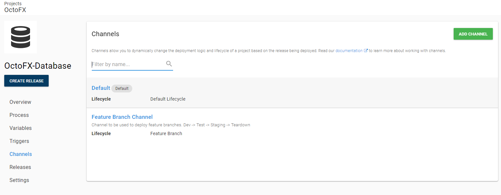
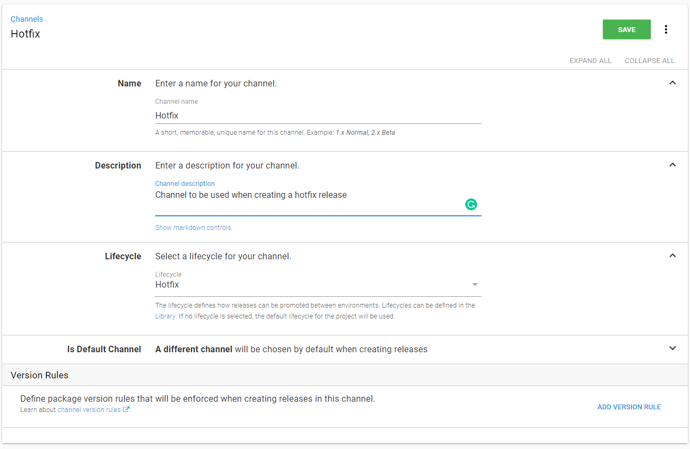
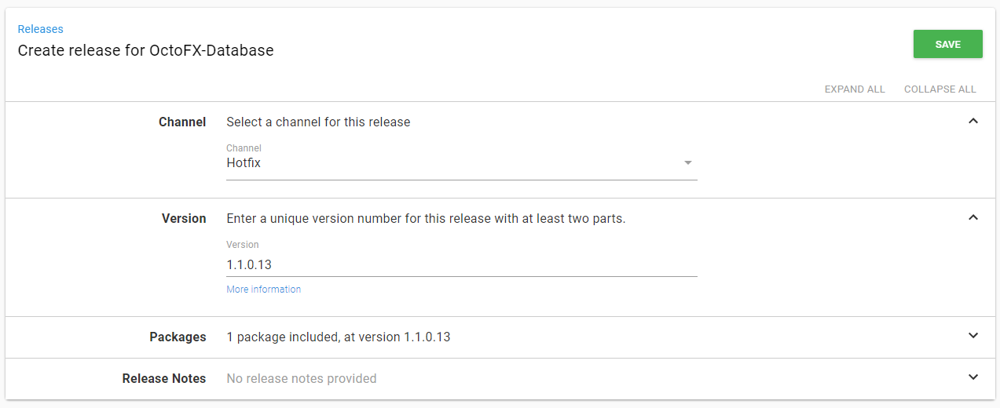
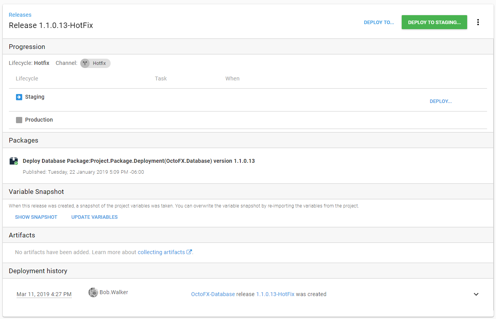
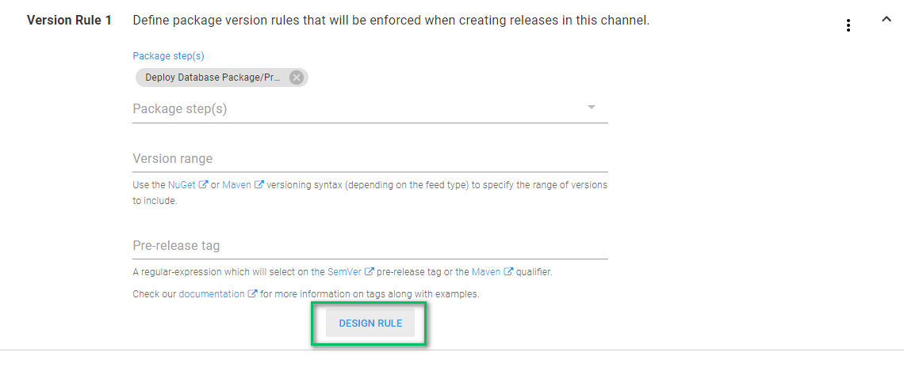
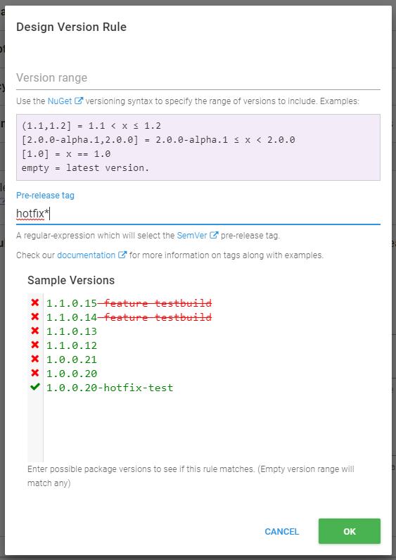
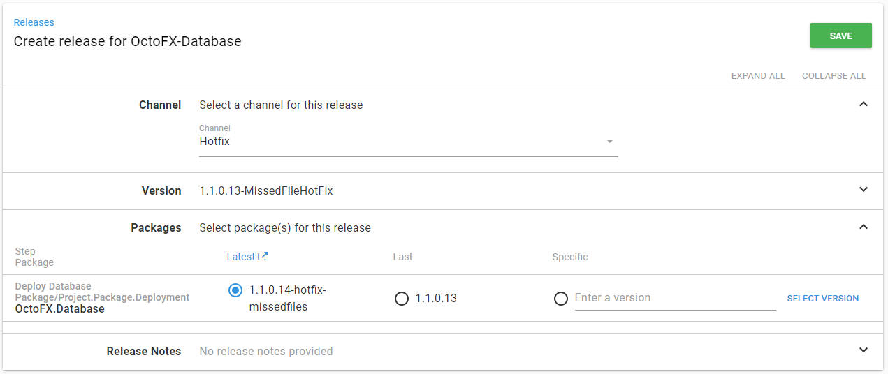
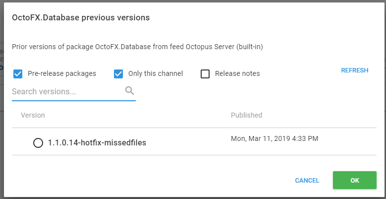

# Hotfixes

It is not a great start to the day.  Production is hosed.  You need to get a hotfix out quickly before the start of business. What do you do? You could make those changes directly to the production database or files, but that's risky and time-consuming. And we already have this tremendous automated deployment pipeline. We just need to configure it for these scenarios. Luckily, we've gone part of the work earlier when we set up our lifecycles. Let's look at the next piece of the puzzle with channels.

## Channels

Channels let you configure your project releases to take different paths. The primary way this happens is that you can assign different lifecycles to each channel. You can limit what versions of packages are available for releases in each channel. You can also scope specific steps and variables to different channels, but for this chapter, we're going to focus on lifecycles and package version rules.

## Creating the Hotfix Channel

Let's navigate over to our OctoFx-Database project and then click on Channels in the project menu.

You'll notice two channels on this page, `Default` and `Feature Branch Channel`.  Every project has a default channel that uses the lifecycle defined on the Process page.  The `Feature Branch Channel` was created in the previous chapter to support feature branch deployments.  

We need to add another channel to handle hotfix deployments.  First, click the `Add Channel` button.  We'll set the name to Hotfix and the Lifecycle to `Hotfix`. 

Let's go ahead and save this and create a release in the channel to see what it looks like.  Click on the `Create Release` button. Before you hit that save button, go ahead and change the Channel from Default to Hotfix.

Once you save the release, you'll notice that our release screen shows the Staging and Production environments only and the deploy button says "Deploy to Staging...". If we jump to the Overview page, you'll see that our releases are grouped by their channel and that the Hotfix channel only has Staging and Production environments. Very nice!

## Adding the Package Version Rule

We highly recommend using either a different version or a pre-release tag to separate your standard releases from your hotfix releases. In this example, we're going to use a pre-release tag of "hotfix" to differentiate our packages. This means that our package will be named something like OctoFX.Database.1.0.40-hotfix.zip.

Usually, a hotfix branch is created from master, either the latest version or a tag that represents the last release, and merged back to master after the hotfix release is complete. This is so that you don't accidentally release new changes that weren't previously on production. We'll also have a separate build for hotfixes that can create the package with the hotfix tag. For now, you can download the latest version of your package, add -hotfix to the name, and upload that as a new version.

Now, let's go back and edit our Hotfix channel. In the Version Rules section, click "Add Version Rule." Choose "Deploy Database Changes" as the Package step. Click on the `Design Rule` button.

When the modal window loads, ignore Version range for now. The version range is handy when you are releasing a newer version of your software, say version 2 versus version 1. The version rule will limit packages with that version to their own channel with scoped steps and variables. Set the Pre-release tag to `hotfix*` and click Save.

Time to create another release.  Expand the Channel and the Packages sections. When you choose the Hotfix channel, you should see the version of the package change to the one with the prerelease tag. 

Clicking on the select version button will load a modal window with only packages versions which match that version rule.

You can override this, but by default, your standard packages can't be used for hotfix releases, and your hotfix packages can't be used for regular releases.

## Conclusion

In this chapter, we covered how to set up a new channel for your project that uses a different lifecycle and different packages from your mainstream releases. Now you're set up to handle emergencies with deployments from Octopus!