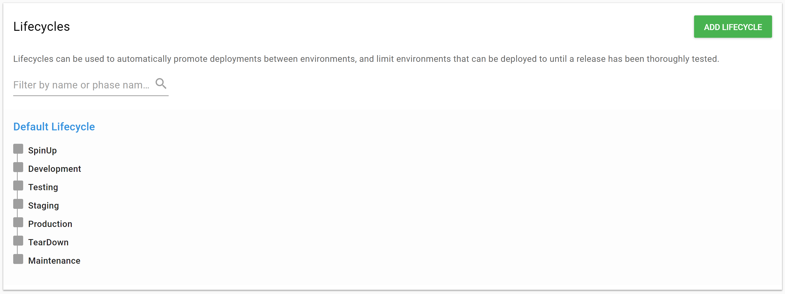
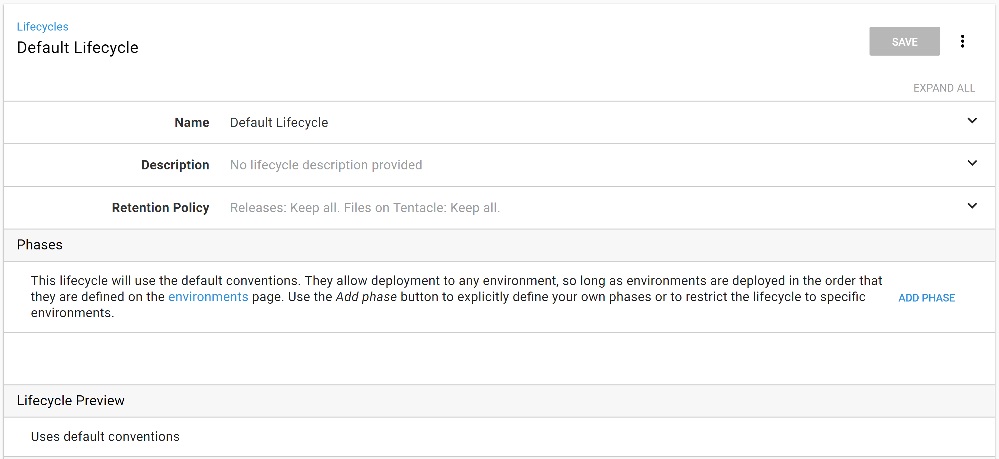
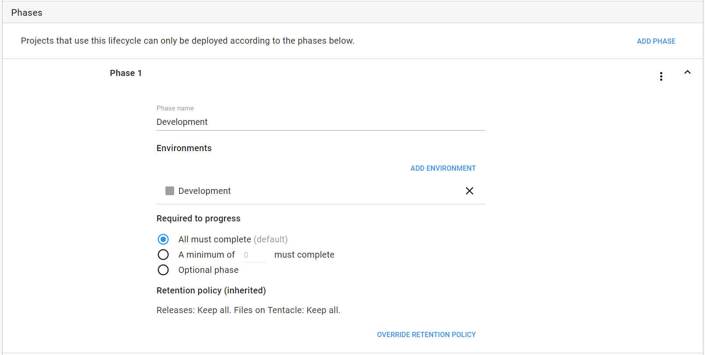
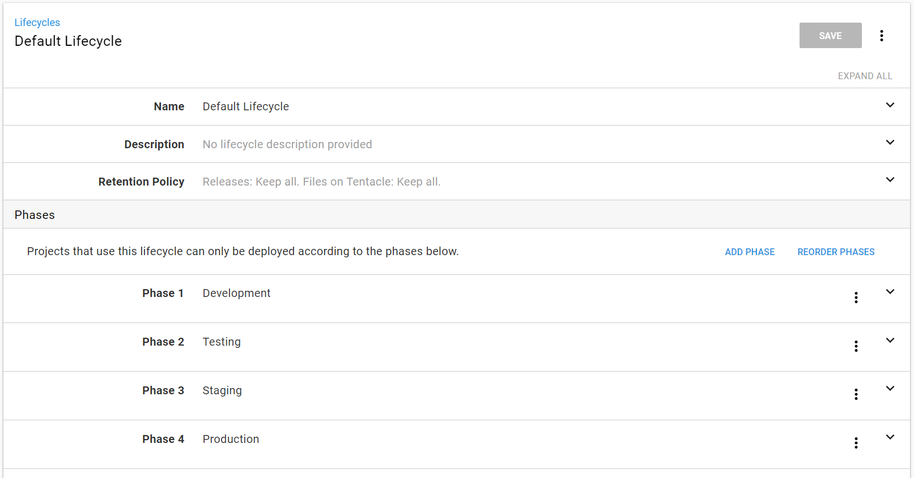

# Lifecycles

Now that we have some environments, it's time to set the order we will use to deploy our applications.  Lifecycles let you define a promotion path for your applications.  You can also use them to automate deployments and set retention policies.

Early in your Octopus journey, you likely won't even know that lifecycles are there.  The default lifecycle will handle most cases for small or straight-forward configurations. Let's talk about the default lifecycle, and why we recommend updating it early on.

## The Default Lifecycle

Navigate to **Library > Lifecycles**, and you'll see a single lifecycle called "Default Lifecycle." Let's take a look at ours.

We can see the environments we created earlier are listed in order. These are phases created implicitly by the default lifecycle. By convention, the default lifecycle will create one phase per environment.  Those phases will be in the same order the environments are listed on the environments page. If we view the default convention, we can see this information in the phases section.

When we add a new environment, it will be automatically added to the default lifecycle. This also means that if we reorder the environments, it will change the order of the phases in the default lifecycle. In some cases, this can be a good thing, but in others, it can be a liability. Let's look at what phases are and how we can use them to explicitly configure the default lifecycle to an explicit configuration.

## Phases

A phase represents a stage in your deployment lifecycle. You deploy to phases in order, and you must have a successful deployment in one phase to move to the next phase. For example, there must be a successful deployment to the Development phase before you can proceed to the Testing phase. Phases can also include multiple environments, but we're going to focus on single environment phases in this chapter.

Let's create a phase for our lifecycle. We will give it the name "Development" and add the Development environment to the phase.

>  Phase names usually match the environment it contains. While this is a good practice, it is not a rule.

We'll leave the radio button set to the default `manually deploy` on the add environment screen.  We'll also leave the `Required to progress` and `Retention policy` set to the default values.  We cover these later.

Let's repeat the process to create phases for Testing, Staging, and Production.

Now we have an explicit default lifecycle for deploying our applications.

## Other Lifecycles

### Hotfix Lifecycle

What happens when there's a critical bug in production, and you need to deploy a fix fast? Deploying to Development and Testing environments might take too much time.  But you still need to follow good deployment practices and validate the change before pushing to production. We often see hotfixes go directly to a Staging environment and then to Production after testing.

For this, we recommend creating a hotfix lifecycle. Our hotfix lifecycle will only have two phases, Staging and Production.  Yours might be different to account for your internal policies and how your team decides to handle hotfixes. In a later chapter, we'll look at how to configure your project to use this lifecycle in addition to the default. For now, we're content setting it so that it's ready to go later.

### Infrastructure as Code Lifecycle

We didn't include SpinUp, TearDown, or Maintenance in the default or hotfix lifecycles. We are going to create a lifecycle for our Infrastructure as Code projects that include SpinUp and TearDown. We'll cover the use of this lifecycle later, but for now, create the lifecycle with a SpinUp and TearDown phase. There is a twist with the SpinUp phase as we're going to make it an optional phase.

#### Optional Phases

One of the settings when creating a phase is the `Required to progress` setting.  The default value is `All must complete`.  All environments in the phase must be deployed to successfully before we can promote to the next phase.

The second choice is to set a minimum number of environments that must be successfully deployed to before promoting to the next phase. This is handy for cases where you have two or three QA environments, but only one is used for each release of your application. You can configure your Testing phase so that it contains three environments, but only one needs to be successful before you can promote to the Staging environment.

The last choice is to set the phase to be entirely optional. The phase can be skipped, and you can deploy directly to the next phase after it.

Because errors and issues can arise when building up infrastructure, especially when setting up the IaC scripts for the first time, we want the option to deploy directly to TearDown so that we can start fresh. As you're setting up these phases, make the SpinUp phase optional.

### Maintenance Lifecycle

The last lifecycle we created was a Maintenance lifecycle. The Maintenance lifecycle and environment will be used for projects that run maintenance tasks such as backups or software upgrades. It can be used for any tasks that you want to run regularly with the same benefits that Octopus provides for your application deployments.

Even though we have grouped the machines for these tasks in the Maintenance environment, you could also split them up into the Development, Testing, Staging, and Production environments if you want to run the tasks for machines in those environments at different times.

Whichever you choose, you know the steps now, so go ahead and create that lifecycle with the phases that you want.

## Conclusion

In this chapter, we configured our default lifecycle. We also created some auxiliary ones to set ourselves up for future success. In the next chapter, we'll walk through retention policies and how to keep your server from being cluttered with old releases and packages.
