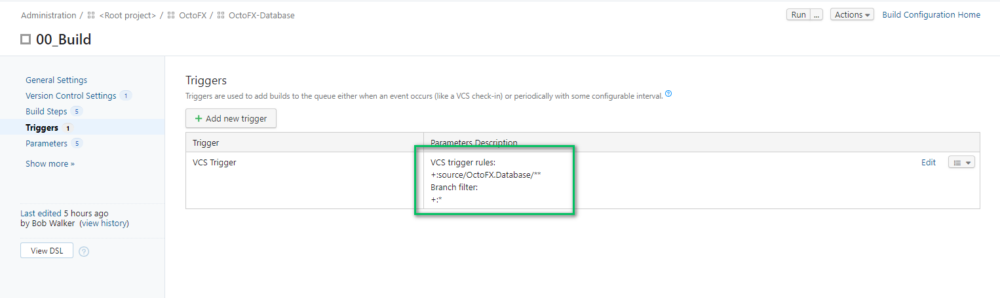
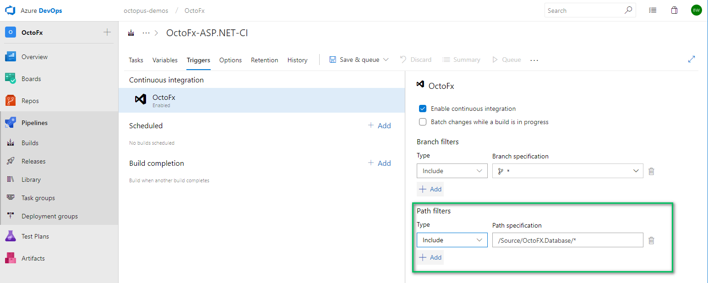
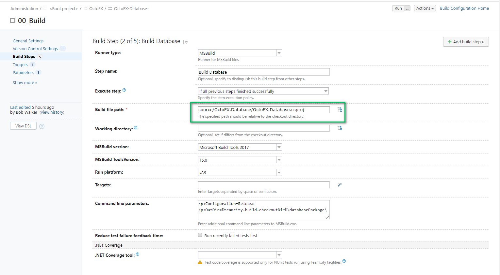
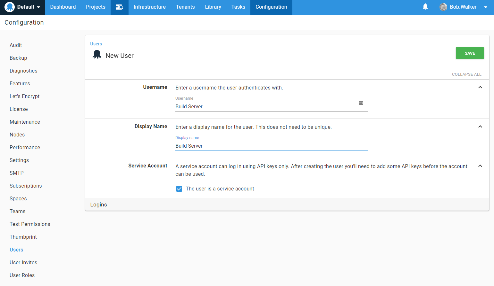
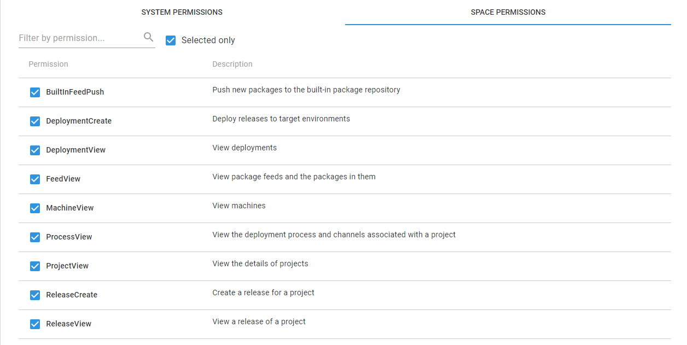
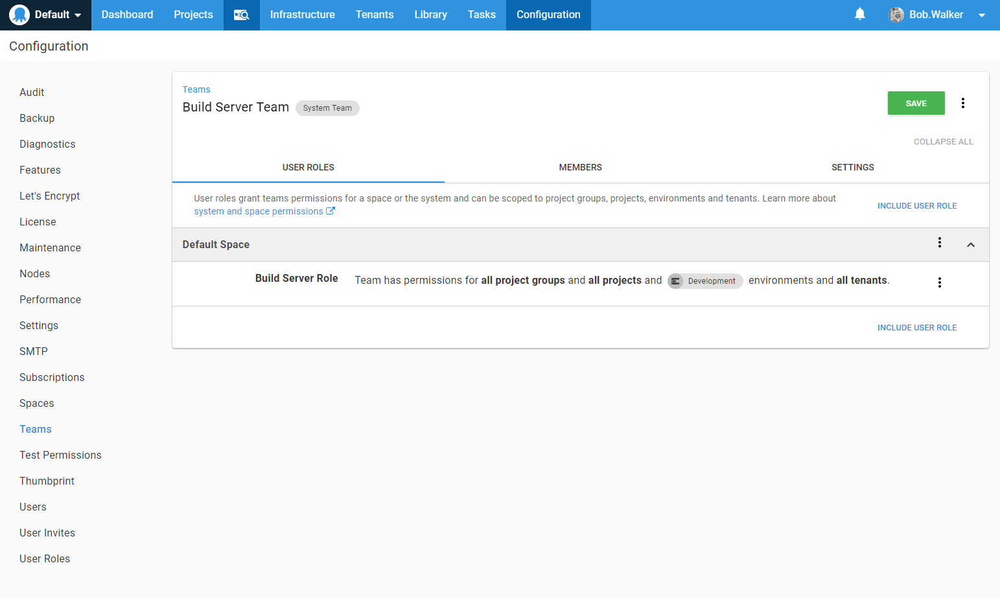

# Packaging Applications on the build server

Octopus Deploy will deploy a wide variety of package formats to deployment targets.  This list includes, but not limited to NuGet packages, Tar packages, as well as Docker Images, Jar files and Zip files.  

The build server, Jenkins, TeamCity, TFS/Azure DevOps, Bamboo, AppVeyor, etc, is most often responsible for packaging applications and pushing that package to Octopus Deploy.  It is possible to package a folder without using a build server, but for the purposes of this book, we are assuming the build server is the one who is packaging the applications.

The build server is responsible for packaging the application is because the build server monitors your source control for any changes.  It builds and tests code once a change is detected.  Once the build server is done it hands the package off to Octopus Deploy to handle the deployments.

Octopus Deploy is build server agnostic.  It does not care where it gets the packages from.  All it cares about is that it gets a package to deploy.  We have written a number of plug-ins to support the more popular build servers.  For the build servers where we don't have a plug-in we have created a command line application called `octo.exe`.  The plug-ins are wrappers for that command line application, so you will get the same functionality as the plug-ins.  

## Build Server Process

Our recommended build server process is:

1) Pull down changes
2) Build Code
3) Run Static Analysis
4) Run Unit Tests
5) Package application
6) Push package to Octopus Deploy
7) Create and deploy release in Octopus Deploy
8) Run integration tests

If any of the preceding steps fail then the build server will fail the build.  This ensures, at a bare minimum, that when Octopus Deploy gets a package to deploy we know the code successfully passed analysis and unit tests.  

The order of the deployment process above was chosen very deliberately.  The goal of that order is to fail fast.  If the code cannot be built there is no reason to run static analysis.  If the static analysis fails there is no need to run unit tests.  This way the build server doesn't waste compute resources on a build.

>  Analysis and tests get exponentially more expensive as you move farther away from the build server.  In terms of time, fixing a problem because of analysis failure is much less expensive than fixing a problem in production.  Unit tests should be self-contained, repeatable and fast.  While integration tests are more "soup to nuts" tests which require external components such as a database or file system.  They tend to be much slower and more expensive to maintain. We've seen some projects with 10,000+ unit tests and a couple of hundred integration tests.  The unit tests took a few minutes to run while the integration tests took 10+ minutes to run.  If there is a problem in the code it should fail as fast as possible.  

## One Source Control Repository or Multiple Source Control Repositories?

If you recall, the OctoFX project has two components, a database and a UI.  Should both components be in the same source control repository or should there be multiple source control repositories.  The answer to that depends on the build server chosen.  Several build servers have the ability to only trigger builds if files in a specific directory are changed.  For example, OctoFx stores the database and WebUI in two folders.

- source/OctoFX.Database
- source/OctoFX.TradingWebsite

It is possible to configure a build server to have two builds, one to watch for changes to the db folder and another to watch for changes to the src folder.  This is done by configuring triggers.  In TeamCity that is done on the trigger page.

In TFS/VSTS/Azure DevOps the trigger is located on the same page where you configure which branch to watch.

Both of these projects are in the same solution.  The build step for each project only builds that project.

It does seem a bit extreme to separate out the components into two builds.  But consider this.  How often do you make a change to just the website?  What if you just make a change to the database, say add a new index?  Should you have to wait for the entire application, both the front-end and database, to be built and tested because of a small index change? 

>  A good rule of thumb is a build shouldn't take any longer than it takes to get a cup of coffee from the break room.

## Building and Packaging using Versioning Schemes

The Major, Minor and Patch, of the version should be stored somewhere in the source control repository or in a variable on the build server.  This provides a source of truth for the version numbers.  

>  When compiling or building the code those values should be used to version the .dlls or .jar files or any other compiled item.  This will allow you to easily see what version is on a specific server.  

For packaging the application to ship to Octopus Deploy you should also include a build number.  For example, if you compiled `1.5.2` then you should include the build number, say 1000, in the package name `1.5.2.1000` or `1.5.2-Build1000` depending on your own internal versioning guidelines.  

>  Including the build number with your package allows you to have multiple builds for the same version.  Very rarely will a version have a single build which makes it all the way to production.

## Releases

We recommend having the build server create and deploy a release to a Development environment.  This allows you to control when code is deployed.  Maybe your project needs to push two packages.  Waiting until after both packages are pushed to create the release ensures Octopus will deploy those two packages at the same time.  

All of our plug-ins allow you to wait for the deployment to Development to complete.  It is recommended you enable that feature.  This way the build will fail if the deployment to development fails.  You can also run integration tests once the deployment is complete.

It is possible to configure the Octopus Deploy server to automatically create a release when a package is pushed, however it only works if a very specific set of conditions are met, such as only using the internal NuGet feed, not using variables for package ids, and so on.  As your Octopus Deploy instance is used by more and more people within your company you will often find those conditions very constricting.  Automatic release creation using Octopus Deploy should be treated as an exception rather than a rule.

## Build Server Permissions

Your build server will need to communicate with the Octopus Deploy server.  In order to do that it will need to use an API Key of a user in Octopus Deploy.  The user should be a service account and not a user account in Octopus Deploy.  This can be done during the user creation process.  You need to click the `The user is a service account` checkbox.

Service accounts don't have passwords.  They only have API Keys.  If an API Key is compromised then all you need to do is delete it.  Password resets are slightly harder.  Also, service accounts are not tied to a specific user.  Often times we have seen a person configure the CI/CD pipeline using an API Key tied to their user account.  When they leave the company the typical clean-up process runs and disables the user account.  Then all the builds start failing because they are unable to deploy.

It is also a good idea to limit what the service account can do.  We recommend creating a custom role for your build server service account which we will call `Build Server Role`.

Create a new team and assign the user and the role to that team.  You can also limit which environments that team can deploy to.  This also helps lock down what that service account can do.

## Conclusion

By integrating a build server into the mix we now have an entire CI/CD pipeline.  If you have any takeaway from this chapter it is you should build your application once and then deploy those same build artifacts across all your servers.  This ensures what you tested in your testing or QA environment is the exact same code which is going to be run in production.  