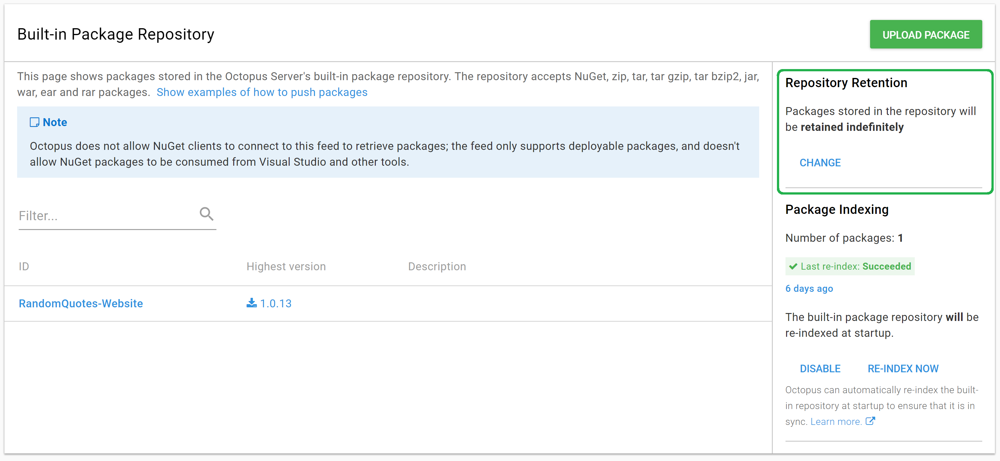

# Retention Policies

When we review a customer's Octopus Deploy configuration, the first thing we ask to see is the retention policies.  Setting appropriate retention policies is an easy win, and they are usually not changed from the default during a trial and not revisited after setting up a production configuration.

Without setting retention policies, Octopus will keep all releases created and packages uploaded indefinitely. If you have small packages or don't release frequently, you may never notice any adverse effects, but as your usage grows, you might run into disk space or performance issues as you server turns into a hoarder.

We haven't covered what packages and releases are yet, but it's okay to set these values now and revisit them when you have a better understanding of what they are.

## Package Retention

First, we'll look at the built-in package repository retention policy. If you're not planning to use the built-in repository, then you don't necessarily need to set this, but it's good to go ahead and set it so that you won't have to remember it if you do start using the repository in the future.

You can see this policy by navigating to **Library > Packages** and looking for `Repository Retention` on the right side of the page.

Let's click `CHANGE` and set this to something less than forever.

Choosing the `A limited time` option will allow you to select the number of days to keep a package in the repository. The default value is 30, but you can choose something shorter or longer based on your needs. Normally we opt for a shorter length of time, for instance, something close to 7 days.

It's important to note here that only packages that are not associated with releases will be cleaned up. That means even if a package is older than the value you choose, if it is attached to an *existing* release, it won't be cleaned up until that release is also cleaned up.

Which leads us to release retention policies!

## Release Retention

Ok, we're going to take a quick trip back to the lifecycles for the next bit. Navigate back to the default lifecycle and expand the `Retention Policy` section.

You can see that this is set to keep all releases forever and also to keep all extracted packages and files on disk on Tentacles. A Tentacle is a deployment target that represents a Windows server.

Let's change this to something a little tidier. You have the choice to clean up after a specified number of releases or a specified number of days. If you're not sure what value to pick, a good value to start with is keeping the last three releases for both the releases and the extracted packages.

There is one nuance to release cleanup. If the release is displayed on any dashboard, either the main dashboard or the project overview screen, it will not be cleaned up even if it matches the rules. You don't have to worry about a recent release in the Staging environment being deleted before it can be promoted to Production. So if you see that a release isn't being cleaned up, check the dashboards to see if it's being displayed.

### Lifecycle Policy

We just set the retention policy for the lifecycle as a whole. Each phase in the lifecycle will use that retention policy. It also means that any releases that are created but not deployed to an environment will also follow this policy.

Why would you create a release and never deploy it? You probably wouldn't, but maybe your build server is creating releases as part of its process, or you have Automatic Release Creation configured on a project. Since it can happen, it's good to have this policy set to clean up any non-deployed releases.

### Phase Policy

When a release moves into a phase, it will take on the retention policy for that phase. Any release deployed to only Development and no farther will use the Development phase's policy while releases that are deployed to Production will use the Production phase's policy. Right now, these are all set to the same policy, which is to inherit the lifecycle's policy.

Let's set the retention policy for the individual phases. We'll skip the Development phase as the lifecycle default of keeping three releases is perfect for our usage. You can keep the Testing phase as the default or something slightly longer like five releases if you'd like.

We prefer to keep the Staging and Production retention policies in sync. It is preferred for them to be time-based instead of keeping a set number of releases. The amount of time to keep them will vary depending on how frequently you release and if you have any regulatory obligations. A good starting point is 30 days, but you may choose 90 days, 365 days, or even choose to retain them forever if that is a requirement.

## Changing Retention Policies on Existing Octopus Servers

If you have an existing Octopus server with a large number of releases and are planning to set some retention policies going forward, we highly recommend starting with a large retention policy and adjusting it down to what you need.

For example, if you have 12 months worth of releases now, perhaps set the retention policy to keep 11 months worth of releases. The Octopus server will apply these retention policies periodically. After it has cleaned up the oldest releases, you can change the policy to keep ten months of releases. Rinse and repeat until you have reached your desired retention policy. You can apply this method with the number of releases instead of the time-based setting.

## Conclusion

In this chapter, we covered retention policies for packages and lifecycles as well as covered the difference between the lifecycle policy and policies at the phase level. We set up some nice defaults that won't come back to bite you months or years down the road. Future you will thank you!

In the next chapter, we will jump into setting up a project and a deployment process!
