# Offloading Work To Workers

When you add a `Run a Script` step, you are asked to define where the script will be run.  If the script is to do some clean-up work after deploying to IIS, it makes sense to run it on a deployment target.  That is pretty clear.  However, what about other scenarios, say sending a notification to slack.  It doesn't make a whole lot of sense to run that on a deployment target.

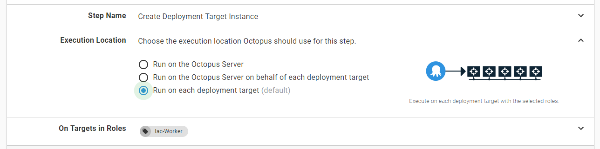

When Octopus Deploy was first created the number of times you would run a script on a server was limited.  Send a slack notification, create a folder name based on some business logic, or notify NewRelic of a deployment.  That work is easy for the server to do.  It doesn't consume resources nor does it take much time.  

With the addition of Platform as a Service options (PaaS), the Octopus Server is being asked to do quite a bit more.  An Azure App Service isn't the same as a VM.  It's not a server where you can download and extract a package.  The deployments all occur over an API.  Anytime you want to deploy an Azure ARM Template, or to a Kubernetes Cluster, you can run that directly on the Octopus Server.

It is entirely possible to have a deployment process run on the Octopus Deploy server.  Running everything on the Octopus Deploy server is not a terrible thing when you have one or two projects, however, it doesn't scale all that well when you have hundreds or thousands of projects.

On top of that, these scripts are running on the Octopus Server.  We like to think most people are good at heart and don't mean any ill-will, however, people make mistakes.  A missing quote here.  A missing quote there.  Before you know it the server hosting Octopus Deploy crashes because of a lousy PowerShell script.  

Those scenarios are why workers were created.  They allow you to move that work from the Octopus Deploy server onto other machines.  This works by creating a worker pool with machines that are available in that pool. When work needs to be done, the machine is leased from the pool, the work is completed on that machine, and the machine is placed back into the pool.

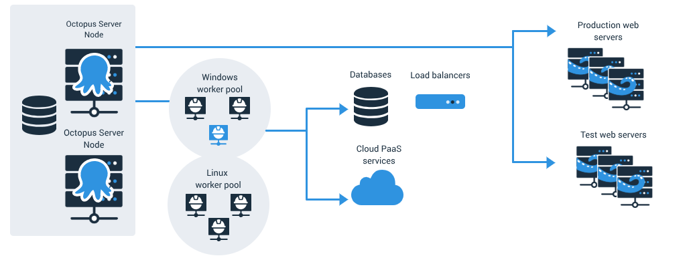

In this chapter, we'll configure worker pools.  While we are doing that we will provide recommendations to help secure your Octopus Server and scale your worker pools.

## Worker Pools

In the diagram above there are two worker pools, Windows and Linux.  That is a good start, however, we recommend creating different worker pools for the different types of work being done.  If you are doing Kubernetes deployments, Azure deployments, and database deployments, then we recommend three worker pools, one for Kubernetes, another for Azure, and another for database deployments.

Breaking apart the worker pools by deployment type provides many benefits.  The servers in each pool only have the be configured to handle the deployment type.  For Kubernetes deployments this means just installing KubeCtl.  While the Azure deployments only need the Azure CLI installed.  Less software to install, reduces the chance of any software conflicts.  You can scale up your worker pools based on need.  If you are deploying to hundreds of databases, then you could have a half dozen workers in the database worker pool.  Meanwhile, if you are only deploying to a couple of Kubernetes clusters, then you might need one or two workers in the Kubernetes worker pool.  

For this demo, we will be adding those three worker pools.  To start, you will go to the infrastructure page and click on worker pools.

When you come to the worker pool page, you will notice there is already a worker pool, the `Default Worker Pool`.  This worker pool is automatically created when you install Octopus Deploy.  When there are no machines in the default worker pool, then the Octopus Server will handle the work.  

Leave the default worker pool alone when configuring workers and worker pools.  Do not add any new machines to the default worker pool.  Leaving the default pool as is will allow you to keep using Octopus Deploy as is while you create new workers and workers pools.  That way you can phase in your rollout of workers rather than making big bang changes.

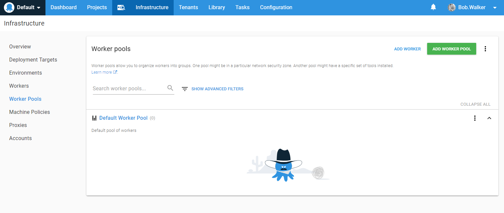

From here we will click on the `Add Worker Pool` button in the top right.  You will be presented with a modal window where you can enter the new worker pool name.

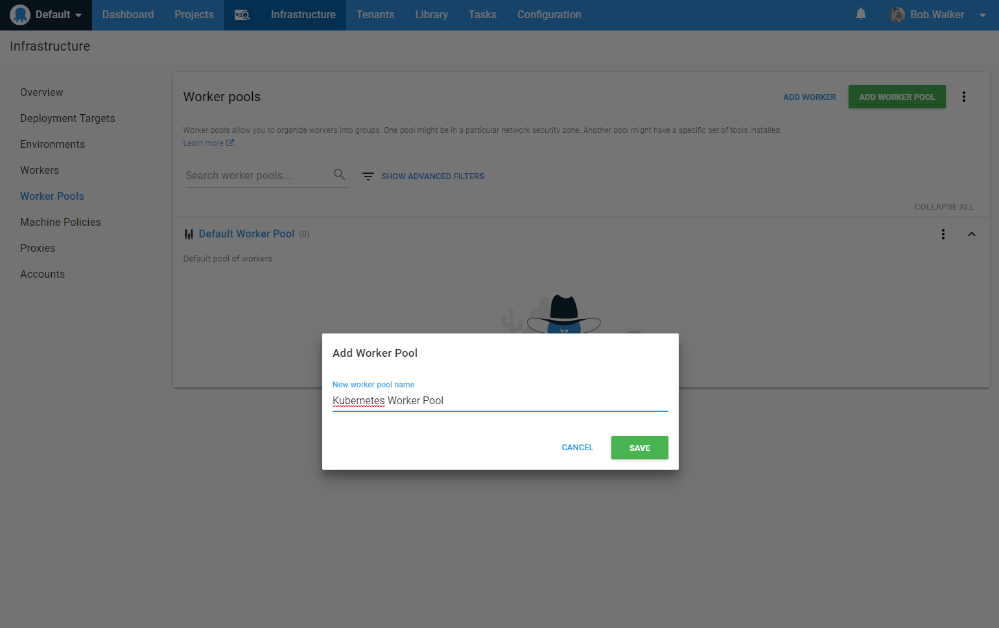

When you click save you will be sent to the worker pool form.  On this form, you can add a description to the worker pool as well as make it the default worker pool.  The worker pool we are adding is for Kubernetes deployments, and we don't want to make it the default worker pool.

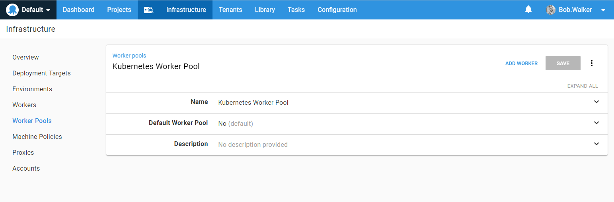

That is it!  We have now configured the first worker pool.  Go ahead and repeat that process two more times to add in the additional worker pools.

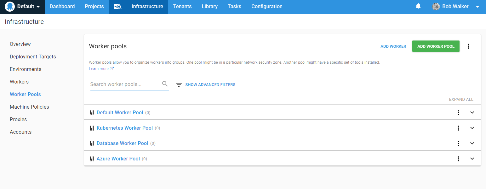

## Workers

Adding workers to a worker pool is just like adding a deployment target to an environment.  At the time of this writing, only three types of deployment targets are supported with worker pools, Polling Tentacles, Listening Tentacles and SSH targets.  It is the same Tentacle you have always installed on a VM.  The primary difference is how it is registered with the Octopus Deploy server.

The form to add a worker is very similar to adding a Tentacle target.  The difference in the form is instead of adding the Tentacle to an environment and assigning it a role; you attach it to a worker pool.

For naming convention, we recommend going with [workertype]-worker-[number].  For example, `database-worker-01`.

## Changing Project Steps to Use Worker Pools

Now that we have added worker pools, you will notice the execution location in the UI has changed.  The text previously said "Run on the Octopus Server" now says "Run once on a worker."  As well, "Run on the Octopus Server on behalf of the deployment target" now reads "Run on a worker on behalf of each deployment target."

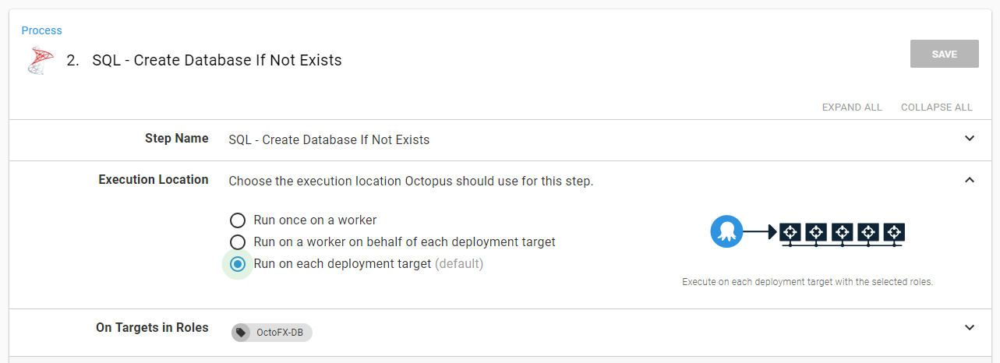

For this demo, we are going to switch all the database steps over to run on the newly created database worker pool.  We are doing this because the steps use SQL Authentication, not Windows Authentication, to log into the SQL Server.

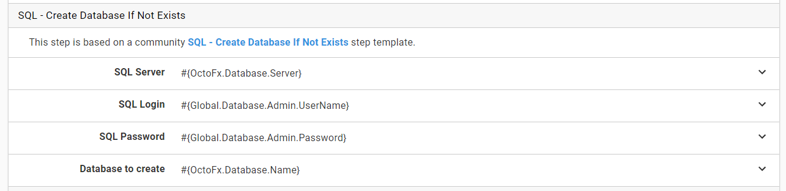

To change it, we change the execution location to "Run once on a worker" and change the worker pool to be "Database Worker Pool."

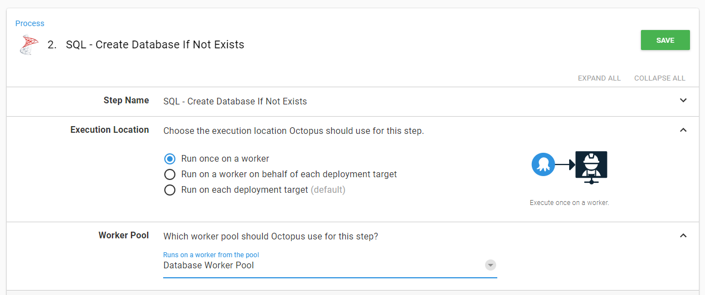

You might be asking yourself, why would I change the database steps over to running on a worker pool?  Well, there are several reasons to make that change.  Right now, we have multiple deployment targets to handle my database deployments.  When we look at our demo instance, we can see there are 12 targets just for database deployments.

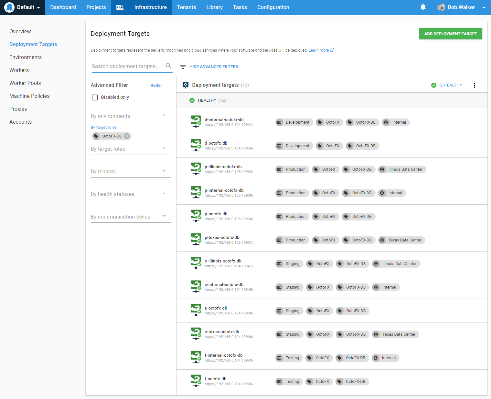

The license we are using for the test instance is limited to 250 machines.  So those 12 deployment targets consume almost 5% of the license.  Besides, database deployments do not manipulate the server like an IIS or Windows Server deployment does.  It needs to communicate with a SQL Server using port 1433.  Because of that, multiple concurrent deployments can occur at once.  Workers allow that.  

The updated process no longer uses deployment targets.  It now uses workers.

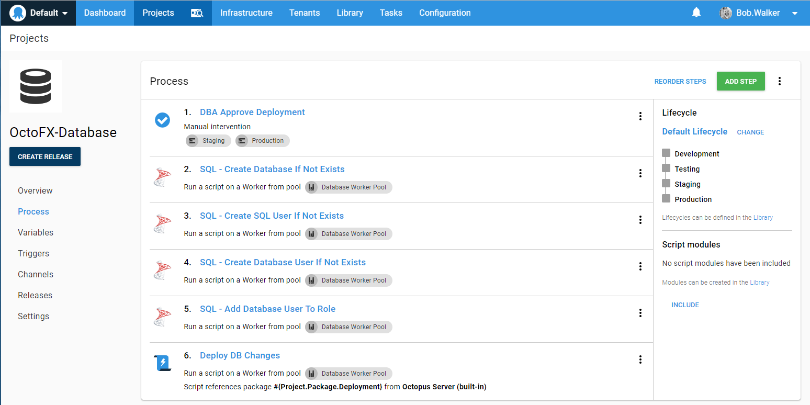

You will notice the last step is running a PowerShell script rather than the deploy a package step.  A new feature added in 2018.8.0 makes it possible to reference packages in the run a script step.  

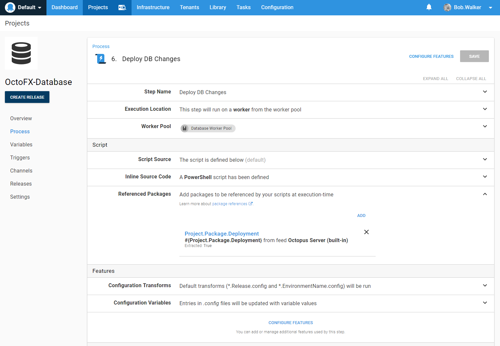

The reference a package feature allows you to specify a package from a feed.  It also allows you to extract the package after downloading it.  Typically users don't extract a package if all they want to do is copy it to a file share or something like that.

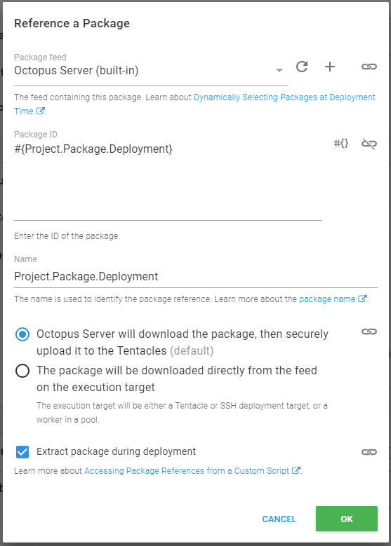

Because you can reference a package, we also added in the ability to do the configuration transforms.  

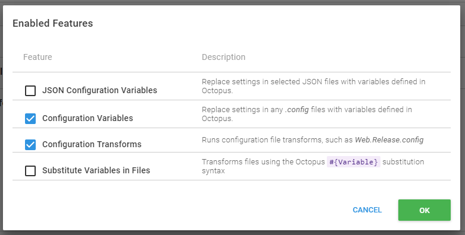

You can reference the package's extracted path in the script.  In this case, we are using DbUp, which means we can execute the console application in the package to do the upgrade.  

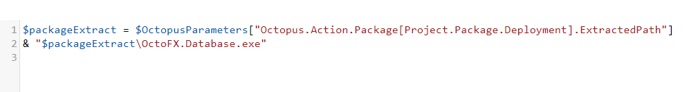

With this flexibility, it is now possible to move quite a lot of steps from deployment targets over to workers.  The added benefit is they are not counted against your license.  This also leaves deployment targets free to do actual deployments to IIS or Windows Services.

## Disabling Executing Scripts on Octopus Server

Now that we have our worker pools configured and projects updated, we can turn off the default worker on the Octopus Server.  This will prevent any script from running on the Octopus Server.  

>  Only do this after you have added worker pools and changed existing projects to use them, otherwise you run the risk of breaking many deployments.

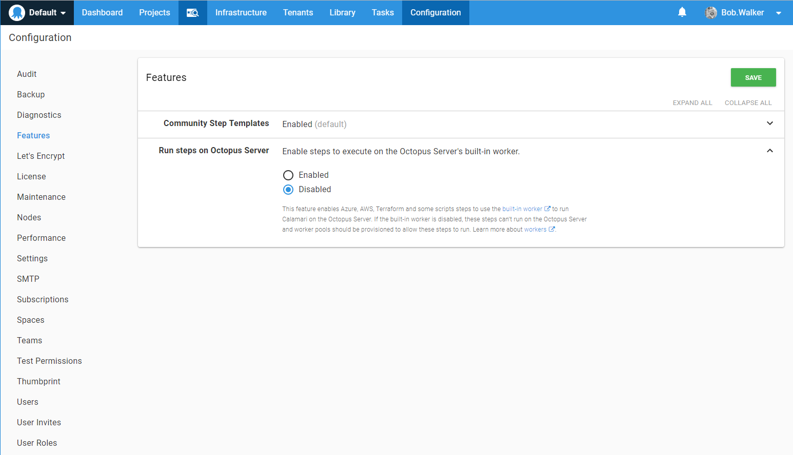

Now all scripts have to run on an external worker.

## Conclusion

Workers allow you to speed up and scale out your Octopus Deploy server with some minor configuration changes.  Workers enable your Octopus Deploy server to focus on orchestration.  Before workers, if you wanted to do Kubernetes deployments, you needed to install KubeCtl on the Octopus Server.  KubeCtl installs required a restart of the service because KubeCtl adds a value to the PATH variable.  By removing Kubernetes deployments from the Octopus Server, we have also eliminated the need to install additional software on the server.  That should decrease the likelihood of any downtime.
